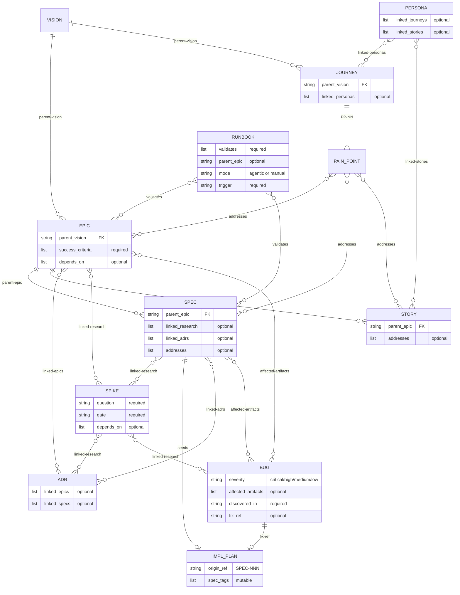

# Spec Management

Create, transition, and validate documentation artifacts. This skill defines the canonical artifact types, phases, and hierarchy — the ER diagram below is the summary; detailed definitions live in `references/`. If the host repo has an AGENTS.md, keep its artifact sections in sync with the skill's reference data.

## Artifact relationship model



**Key:** Solid lines (`||--o{`) = mandatory hierarchy. Diamond lines (`}o--o{`) = informational cross-references. SPIKE can attach to any artifact type, not just SPEC. Any artifact can declare `depends-on:` blocking dependencies on any other artifact.

## Stale reference watcher

The `specwatch.sh` script monitors `docs/` for file moves, renames, and deletes, and flags stale markdown link references with suggested fixes.

**Script location:** `scripts/specwatch.sh` (relative to this skill)

**Subcommands:**

| Command | What it does |
|---------|-------------|
| `scan` | Run a full stale-reference scan (no watcher needed) |
| `watch` | Start background filesystem watcher (requires `fswatch`) |
| `stop` | Stop a running watcher |
| `status` | Show watcher status and log summary |
| `touch` | Refresh the sentinel keepalive timer |

**Log format:** When stale references are found, they are written to `.agents/specwatch.log` in a structured format. This file is a runtime artifact — add `specwatch.log` to your `.gitignore` if it isn't already.
```
STALE <source-file>:<line>
  broken: <relative-path-as-written>
  found: <suggested-new-path>
  artifact: <TYPE-NNN>
```

### Bookends for every artifact operation

**Before:** Run `scripts/specwatch.sh scan`. If `.agents/specwatch.log` is produced, surface stale references as warnings and fix them (or acknowledge false positives) before proceeding. Delete the log when clear. The scan has no external dependencies — it uses only Python 3 and the filesystem.

**After:** Run `scripts/specwatch.sh scan` again to catch any stale references introduced by the operation itself.

The background `watch` mode (requires `fswatch`) is available for long-running sessions but is not part of the default workflow.

## Dependency graph

The `specgraph.sh` script builds and queries the artifact dependency graph from frontmatter. It caches a JSON graph in `/tmp/` and auto-rebuilds when any `docs/*.md` file changes.

**Script location:** `scripts/specgraph.sh` (relative to this skill)

**Subcommands:**

| Command | What it does |
|---------|-------------|
| `overview` | **Default.** Hierarchy tree with status indicators + execution tracking |
| `build` | Force-rebuild graph from frontmatter |
| `blocks <ID>` | What does this artifact depend on? (direct dependencies) |
| `blocked-by <ID>` | What depends on this artifact? (inverse lookup) |
| `tree <ID>` | Transitive dependency tree (all ancestors) |
| `ready` | Active/Planned artifacts with all deps resolved |
| `next` | What to work on next (ready items + what they unblock, blocked items + what they need) |
| `mermaid` | Mermaid diagram to stdout |
| `status` | Summary table by type and phase |

Run `blocks <ID>` before phase transitions to verify dependencies are resolved. Run `ready` to find unblocked work. Run `tree <ID>` for transitive dependency chains.

## Lifecycle table format

Every artifact embeds a lifecycle table tracking phase transitions:

```markdown
### Lifecycle

| Phase | Date | Commit | Notes |
|-------|------|--------|-------|
| Planned | 2026-02-24 | abc1234 | Initial creation |
| Active  | 2026-02-25 | def5678 | Dependency X satisfied |
```

Commit hashes reference the repo state at the time of the transition, not the commit that writes the hash stamp itself. Commit the transition first, then stamp the resulting hash into the lifecycle table and index in a second commit. This keeps the stamped hash reachable in git history.

## Index maintenance

Every doc-type directory keeps a single lifecycle index (`list-<type>.md`). **Refreshing the index is the final step of every artifact operation** — creation, content edits, phase transitions, and abandonment. No artifact change is complete until the index reflects it.

### What "refresh" means

1. Read (or create) `docs/<type>/list-<type>.md`.
2. Ensure one table per active lifecycle phase, plus a table for each end-of-life phase that has entries.
3. For the affected artifact, update its row: title, current phase, last-updated date, and commit hash of the change.
4. If the artifact moved phases, remove it from the old phase table and add it to the new one.
5. Sort rows within each table by artifact number.

### When to refresh

| Operation | Trigger |
|-----------|---------|
| Create artifact | New row in the appropriate phase table |
| Edit artifact content or frontmatter | Update last-updated date and commit hash |
| Transition phase | Move row between phase tables |
| Abandon / end-of-life | Move row to the end-of-life table |

This rule is referenced as the **index refresh step** in the workflows below. Do not skip it.

## Auditing artifacts

Audits touch every artifact, so **always parallelize with sub-agents** — serial auditing is too slow and misses the cross-cutting checks that only make sense when run together. Spawn three agents in a single turn:

| Agent | Responsibility |
|-------|---------------|
| **Lifecycle auditor** | Check every artifact in `docs/` for valid status field, lifecycle table with hash stamps, and matching row in the appropriate `list-<type>.md` index. |
| **Cross-reference checker** | Verify all `parent-*`, `depends-on`, `linked-*`, and `addresses` frontmatter values resolve to existing artifact files. Flag dangling references. |
| **Naming & structure validator** | Confirm directory/file names follow `(TYPE-NNN)-Title` convention, templates have required frontmatter fields, and folder-type artifacts contain a primary `.md` file. |
| **Phase/folder alignment** | Run `specwatch.sh phase-check` to detect artifacts whose frontmatter `status:` doesn't match their phase subdirectory. If mismatches are found, run `specwatch.sh phase-fix` to move them with `git mv`, then review and commit the staged renames. |

Each agent reports gaps as a structured table with file path, issue type, and missing/invalid field. Merge the three tables into a single audit report. Always include a 1-2 sentence summary of each artifact (not just its title) in result tables.

## Status overview

When the user asks for status, progress, or "what's next?", **default to showing both spec-management and execution-tracking layers** unless they specifically ask for only one. The `overview` command is the single entry point.

### `specgraph.sh overview` (primary — use this by default)

Renders a hierarchy tree in the terminal showing every artifact with its status, blocking dependencies, and execution-tracking progress:

```
  ✓ VISION-001: Personal Agent Patterns [Active]
  ├── → EPIC-007: Spec Management System [Active]
  │   ├── ✓ SPEC-001: Artifact Lifecycle [Implemented]
  │   ├── ✓ SPEC-002: Dependency Graph [Implemented]
  │   └── → SPEC-003: Cross-reference Validation [Draft]
  │         ↳ blocked by: SPIKE-002
  └── → EPIC-008: Execution Tracking [Proposed]

── Cross-cutting ──
  ├── → ADR-001: Graph Storage Format [Adopted]
  └── → PERSONA-001: Solo Developer [Validated]

── Execution Tracking ──
  (bd status output here)
```

**Status indicators:** `✓` = resolved (Complete/Implemented/Adopted/etc.), `→` = active/in-progress. Blocked dependencies show inline with `↳ blocked by:`. Cross-cutting artifacts (ADR, Persona, Runbook, Bug, Spike) appear in their own section. The execution-tracking tail calls `bd status` automatically.

### Other read-only commands

| Command | When to use |
|---------|-------------|
| `specgraph.sh status` | Flat summary table grouped by artifact type — useful for counts and phase distribution |
| `specgraph.sh next` | Ready items + what they'd unblock, blocked items + what they need — useful for deciding what to work on |
| `specgraph.sh mermaid` | Mermaid diagram to stdout — useful for documentation or visual export |

## Creating artifacts

### Error handling

When an operation fails (missing parent, number collision, script error, etc.), consult [references/troubleshooting.md](references/troubleshooting.md) for the recovery procedure. Do not improvise workarounds — the troubleshooting guide covers the known failure modes.

### Workflow

1. Scan `docs/<type>/` (recursively, across all phase subdirectories) to determine the next available number for the prefix.
2. Read the artifact's definition file and template from the lookup table below.
3. Create the artifact in the correct phase subdirectory (usually the first phase — e.g., `docs/epic/Proposed/`, `docs/spec/Draft/`). See the definition file for the exact directory structure.
4. Populate frontmatter with the required fields for the type (see the template).
5. Initialize the lifecycle table with the appropriate phase and current date. This is usually the first phase (Draft, Planned, etc.), but an artifact may be created directly in a later phase if it was fully developed during the conversation (see [Phase skipping](#phase-skipping)).
6. Validate parent references exist (e.g., the Epic referenced by a new Agent Spec must already exist).
7. **Index refresh step** — update `list-<type>.md` (see [Index maintenance](#index-maintenance)).

### Artifact type definitions

Each artifact type has a definition file (lifecycle phases, conventions, folder structure) and a template (frontmatter fields, document skeleton). **Read the definition for the artifact type you are creating or transitioning.**

| Type | Definition | Template |
|------|-----------|----------|
| Product Vision (VISION-NNN) | [references/vision-definition.md](references/vision-definition.md) | [references/vision-template.md.template](references/vision-template.md.template) |
| User Journey (JOURNEY-NNN) | [references/journey-definition.md](references/journey-definition.md) | [references/journey-template.md.template](references/journey-template.md.template) |
| Epic (EPIC-NNN) | [references/epic-definition.md](references/epic-definition.md) | [references/epic-template.md.template](references/epic-template.md.template) |
| User Story (STORY-NNN) | [references/story-definition.md](references/story-definition.md) | [references/story-template.md.template](references/story-template.md.template) |
| Agent Spec (SPEC-NNN) | [references/spec-definition.md](references/spec-definition.md) | [references/spec-template.md.template](references/spec-template.md.template) |
| Research Spike (SPIKE-NNN) | [references/spike-definition.md](references/spike-definition.md) | [references/spike-template.md.template](references/spike-template.md.template) |
| Persona (PERSONA-NNN) | [references/persona-definition.md](references/persona-definition.md) | [references/persona-template.md.template](references/persona-template.md.template) |
| ADR (ADR-NNN) | [references/adr-definition.md](references/adr-definition.md) | [references/adr-template.md.template](references/adr-template.md.template) |
| Runbook (RUNBOOK-NNN) | [references/runbook-definition.md](references/runbook-definition.md) | [references/runbook-template.md.template](references/runbook-template.md.template) |
| Bug (BUG-NNN) | [references/bug-definition.md](references/bug-definition.md) | [references/bug-template.md.template](references/bug-template.md.template) |

## Phase transitions

### Phase skipping

Phases listed in the artifact definition files are available waypoints, not mandatory gates. An artifact may skip intermediate phases and land directly on a later phase in the sequence. This is normal in single-user workflows where drafting and review happen conversationally in the same session.

- The lifecycle table records only the phases the artifact actually occupied — one row per state it landed on, not rows for states it skipped past.
- Skipping is forward-only: an artifact cannot skip backward in its phase sequence.
- **Abandoned** is a universal end-of-life phase available from any state, including Draft. It signals the artifact was intentionally not pursued. Use it instead of deleting artifacts — the record of what was considered and why it was dropped is valuable.
- Other end-of-life transitions (Sunset, Retired, Superseded, Archived, Deprecated) require the artifact to have been in an active state first — you cannot skip directly from Draft to Retired.

### Workflow

1. Validate the target phase is reachable from the current phase (same or later in the sequence; intermediate phases may be skipped).
2. **Move the artifact** to the new phase subdirectory using `git mv` (e.g., `git mv docs/epic/Proposed/(EPIC-001)-Foo/ docs/epic/Active/(EPIC-001)-Foo/`). Every artifact type uses phase subdirectories — see the artifact's definition file for the exact directory names.
3. Update the artifact's status field in frontmatter to match the new phase.
4. Commit the transition change (move + status update).
5. Append a row to the artifact's lifecycle table with the commit hash from step 4.
6. Commit the hash stamp as a **separate commit** — never amend. Two distinct commits keeps the stamped hash reachable in git history and avoids interactive-rebase pitfalls.
7. **Index refresh step** — move the artifact's row to the new phase table (see [Index maintenance](#index-maintenance)).

### Completion rules

- An Epic is "Complete" only when all child Agent Specs are "Implemented" and success criteria are met.
- An Agent Spec is "Implemented" only when its implementation plan is closed (or all tasks are done in fallback mode).
- An ADR is "Superseded" only when the superseding ADR is "Adopted" and links back.

## Implementation plans

Implementation plans bridge declarative specs (`docs/`) and execution tracking. They are not doc-type artifacts. All CLI operations are handled by the **execution-tracking** skill — invoke it to bootstrap the task backend before creating plans.

### Workflow

1. A Spec/Epic's "Implementation Approach" section seeds the plan but is not the plan of record.
2. Create an implementation plan linked via an **origin ref** (e.g., `SPEC-003`). Create tasks with dependencies, each tagged with **spec tags** for originating specs.
3. When a task impacts additional specs, add spec tags and cross-plan dependencies.

### Closing the loop

- Progress lives in the execution backend, not the spec doc. Transition the spec to "Implemented" once the plan completes.
- Note cross-spec tasks in each affected artifact's lifecycle entry (e.g., "Implemented — shared serializer also covers SPEC-007").
- If execution reveals the spec is unworkable, the execution-tracking skill's escalation protocol flows control back to this skill for spec updates before re-planning.

### Fallback

If execution-tracking is unavailable, fall back to the agent's built-in todo system (`todo`, `in_progress`, `blocked`, `done`). Maintain lineage by including artifact IDs in task titles (e.g., `[SPEC-003] Add export endpoint`).
