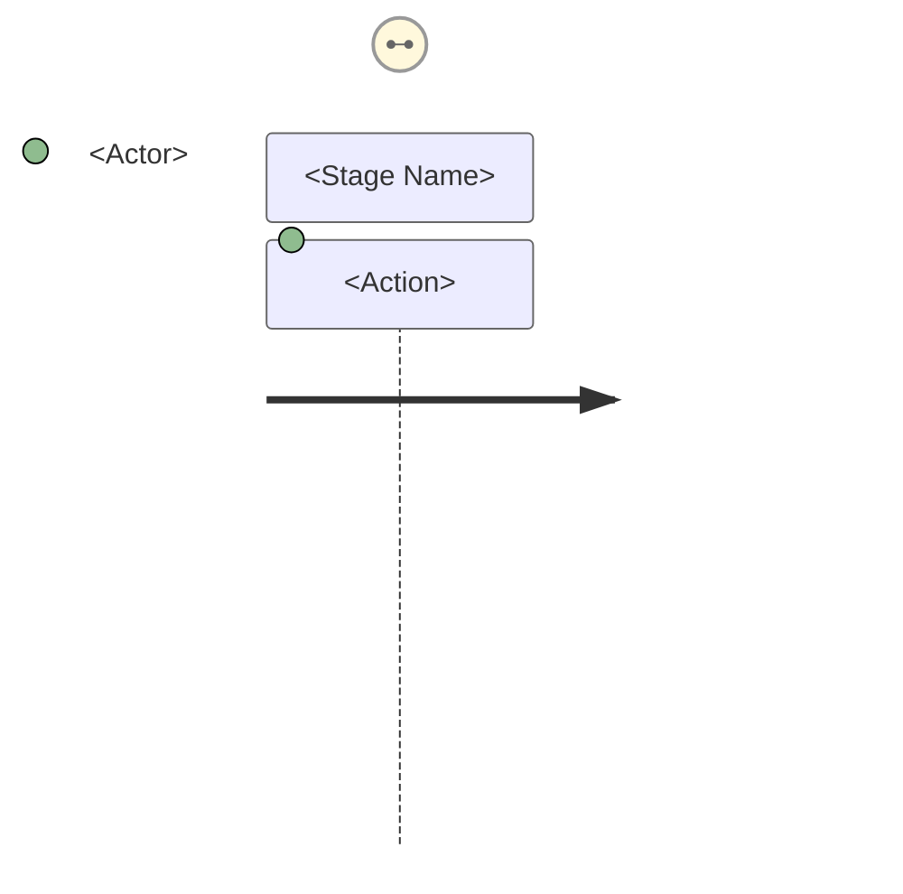
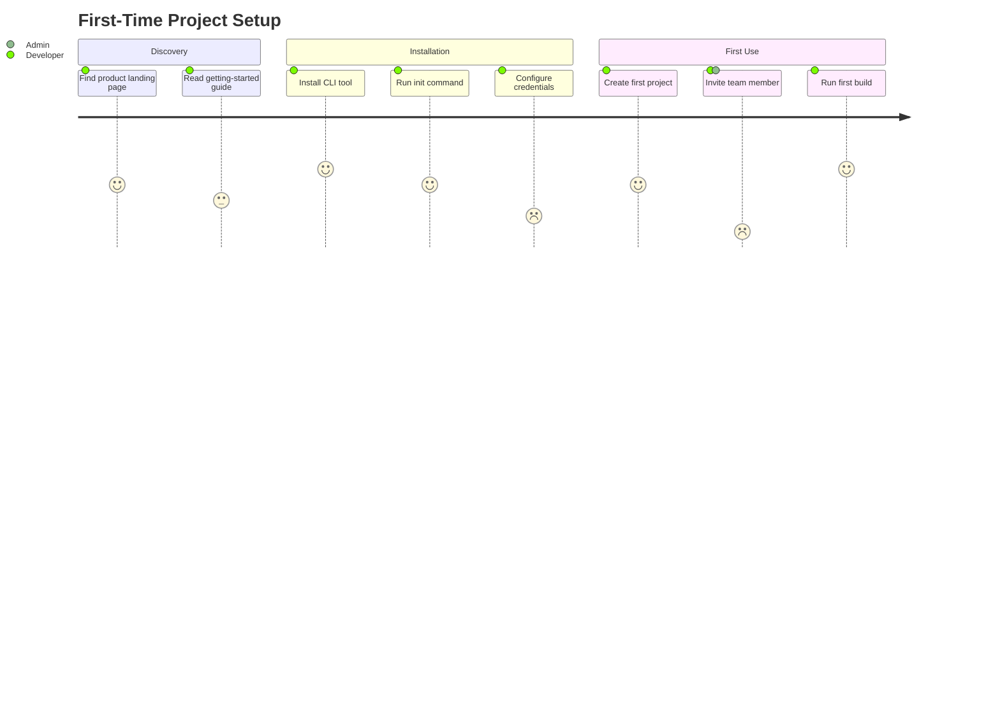

# Spec Management

Create, transition, and validate documentation artifacts defined in AGENTS.md. The authoritative list of artifact types, phases, and hierarchy lives in AGENTS.md — this skill provides the operational procedures.

## Lifecycle table format

Every artifact embeds a lifecycle table tracking phase transitions:

```markdown
### Lifecycle

| Phase | Date | Commit | Notes |
|-------|------|--------|-------|
| Planned | 2026-02-24 | abc1234 | Initial creation |
| Active  | 2026-02-25 | def5678 | Dependency X satisfied |
```

Commit hashes reference the repo state at the time of the transition, not the commit that writes the hash stamp itself. Commit first, then stamp the hash and amend — the pre-amend hash is the correct value.

## Creating artifacts

### Workflow

1. Scan `docs/<type>/` to determine the next available number for the prefix.
2. Create the artifact using the appropriate format (see AGENTS.md artifact types table).
3. Populate frontmatter with the required fields for the type (see sections below).
4. Initialize the lifecycle table with the appropriate phase and current date. This is usually the first phase (Draft, Planned, etc.), but an artifact may be created directly in a later phase if it was fully developed during the conversation (see [Phase skipping](#phase-skipping)).
5. Update or create the `list-<type>.md` index in the type's directory.
6. Validate parent references exist (e.g., the Epic referenced by a new PRD must already exist).

### Product Vision (VISION-NNN)

The highest-level specification artifact. Defines *what the product is* and *why it exists*. Typically one per product or major product area. Uses folder format to accommodate supporting documents.

- **Folder structure:** `docs/vision/(VISION-NNN)-<Title>/`
  - Primary file: `(VISION-NNN)-<Title>.md` — the vision document itself.
  - Supporting docs live alongside it in the same folder. These are NOT numbered artifacts — they are informal reference material owned by the Vision.
  - Typical supporting docs: competitive analysis, market research, positioning docs, persona summaries, **architecture overview**.
- **Architecture overview vs. ADRs:** An `architecture-overview.md` in the Vision folder describes *how the system works holistically* — a living description of the system shape. It is descriptive, not decisional. Individual architectural *decisions* ("we chose X over Y because Z") belong in ADRs. When extracting architecture content from a Vision document, split it: the holistic description stays as a Vision supporting doc; discrete decisions with alternatives considered become ADRs.
- Frontmatter must include: title, status, author, created date, last updated date.
- Must define: target audience, value proposition, success metrics, non-goals.
- Should be stable — update infrequently. If a Vision needs frequent revision, it is likely scoped too narrowly (should be an Epic) or too early (needs a Spike first).
- Vision documents do NOT contain implementation details, timelines, or task breakdowns.

### User Journey (JOURNEY-NNN)

Maps an end-to-end user experience across features and touchpoints. Journeys describe *how a user accomplishes a goal* and surface pain points and opportunities that inform which Epics to create.

- **Folder structure:** `docs/journey/(JOURNEY-NNN)-<Title>/`
  - Primary file: `(JOURNEY-NNN)-<Title>.md` — the journey narrative.
  - Supporting docs: flow charts, interview notes, extended research.
- Frontmatter must include: title, status, author, created date, last updated date, parent Vision, and linked Persona(s).
- Must define: persona (who — reference a PERSONA-NNN artifact), goal (what they're trying to accomplish), steps/stages (the flow), pain points (friction), and opportunities (where the product can improve).
- A Journey is "Validated" when its steps and pain points have been confirmed through user research, stakeholder review, or prototype testing.
- Journeys are *discovery artifacts* — they inform Epic and PRD creation but are not directly implemented. They do NOT contain acceptance criteria or task breakdowns.

#### Mermaid journey diagram

Every journey MUST include a Mermaid `journey` diagram embedded in the primary file. The diagram is a structured visualization of the narrative — it encodes stages, actions, satisfaction levels, and actors in a single view. Place the diagram immediately after the **Steps / Stages** section.

**Syntax:**

~~~markdown

~~~

**Mapping conventions:**

| Journey element | Mermaid element | Rule |
|-----------------|-----------------|------|
| Steps / stages | `section` blocks | One section per stage, in narrative order |
| Actions within a stage | Task lines | Concise verb phrases (3-6 words) |
| Persona | Actor name | Use the persona's archetype label from its PERSONA-NNN, not the artifact ID |
| System / other actors | Additional actors | Add when a handoff or interaction with another party occurs |

**Satisfaction scores** (1–5 scale):

| Score | Sentiment | Signals |
|-------|-----------|---------|
| 5 | Delighted | Moment of delight, exceeds expectations |
| 4 | Satisfied | Works well, minor friction at most |
| 3 | Neutral | Functional but unremarkable |
| 2 | Frustrated | Noticeable friction — flags a **pain point** |
| 1 | Blocked | Severe friction or failure — flags a critical **pain point** |

Every pain point identified in the narrative MUST appear as a score ≤ 2 task in the diagram, and every score ≤ 2 task MUST have a corresponding pain point in the narrative. This keeps the diagram and narrative in sync.

**Example:**

~~~markdown

~~~

In this example, "Configure credentials" (2) and "Invite team member" (1) surface as pain points — the narrative must describe the corresponding friction and opportunities.

**Workflow integration:**

- When creating a journey, draft the narrative first, then build the diagram from it. The diagram is a *derived visualization*, not the source of truth — the narrative is.
- When updating a journey (adding stages, revising pain points), update **both** the narrative and the diagram in the same commit.
- When transitioning a journey to Validated, confirm that satisfaction scores reflect validated research findings, not initial assumptions. Adjust scores as user feedback dictates.

### Epics (EPIC-NNN)

A strategic initiative that decomposes into multiple PRDs, Spikes, and ADRs. The **coordination layer** between product vision and feature-level work.

- Frontmatter must include: title, status, author, created date, last updated date, parent Vision, success criteria.
- Must define: goal/objective, scope boundaries, child PRD list (updated as PRDs are created), and key dependencies on other Epics.
- An Epic is "Complete" when all child PRDs reach "Implemented" and success criteria are met.
- An Epic is "Archived" after completion, when it no longer requires active reference.

### User Story (STORY-NNN)

The atomic unit of user-facing requirements. Captures a single capability from the user's perspective with clear acceptance criteria. Decomposes an Epic into verifiable, implementable increments.

- **Format:** Single markdown file at `docs/story/(STORY-NNN)-<Title>.md`.
- Frontmatter must include: title, status, author, created date, last updated date, parent Epic, and optionally linked Journey(s).
- Must follow the canonical format:
  - **As a** [role/persona], **I want** [capability], **so that** [benefit/outcome].
  - **Acceptance criteria:** Numbered list of testable conditions that must be true for the story to be complete.
- Stories should be small enough to implement and verify independently. If a story requires multiple PRDs, it is likely scoped too broadly (should be an Epic).
- A Story is "Ready" when acceptance criteria are defined and agreed upon. A Story is "Implemented" when all acceptance criteria pass.
- Stories can link to Journeys via `related` frontmatter to show which user experience they improve.

### PRDs (PRD-NNN)

- Frontmatter must include: title, status, author, created date, last updated date, parent Epic, and linked research artifacts and/or ADRs.
- Should be scoped to something a team (or agent) can ship and validate independently.

### Research Spikes (SPIKE-NNN)

- Number in intended execution order — sequence communicates priority.
- Frontmatter must state: question, gate (e.g., Pre-MVP), risks addressed, dependencies, and what it blocks.
- Gating spikes must define go/no-go criteria with measurable thresholds (not just "investigate X").
- Gating spikes must recommend a specific pivot if the gate fails (not just "reconsider approach").
- Spikes can belong to any artifact type (Vision, Epic, PRD, ADR, Persona). The owning artifact controls all spike tables: questions, risks, gate criteria, dependency graph, execution order, phase mappings, and risk coverage. There is no separate research roadmap document.

### Personas (PERSONA-NNN)

A user archetype that represents a distinct segment of the product's audience. Personas are cross-cutting — they are referenced by Journeys, Stories, Visions, and other artifacts but are not owned by any single one.

- **Folder structure:** `docs/persona/(PERSONA-NNN)-<Title>/`
  - Primary file: `(PERSONA-NNN)-<Title>.md` — the persona definition.
  - Supporting docs: interview notes, survey data, behavioral research, demographic analysis.
- Frontmatter must include: title, status, author, created date, last updated date, and links to all Journeys and Stories that reference this persona.
- Must define: name/archetype label, demographic summary, goals and motivations, frustrations and pain points, behavioral patterns, and context of use (when/where/how they interact with the product).
- A Persona is "Validated" when its attributes have been confirmed through user research, interviews, or data analysis — not just assumed.
- Personas are *reference artifacts* — they inform Journey, Story, and PRD creation but are not directly implemented. They do NOT contain acceptance criteria, task breakdowns, or feature specifications.

### ADRs (ADR-NNN)

- Frontmatter must include: title, status, author, created date, last updated date, and links to all affected Epics/PRDs.
- ADRs are cross-cutting: they link to all affected artifacts but are not owned by any single one.
- ADRs record **decisions**: a specific choice between alternatives, with rationale and consequences. They require status, alternatives considered, and a decision outcome.
- ADRs are NOT for descriptive or explanatory architecture content. If the content describes "how the system works" without presenting a decision between alternatives, it belongs as an architecture overview supporting doc in the Vision folder — not as an ADR.
- Use the Draft phase while investigation (Spikes) is still in progress. Move to Proposed when the recommendation is formed and ready for review.

## Phase transitions

### Phase skipping

Phases listed in AGENTS.md are available waypoints, not mandatory gates. An artifact may skip intermediate phases and land directly on a later phase in the sequence. This is normal in single-user workflows where drafting and review happen conversationally in the same session.

- The lifecycle table records only the phases the artifact actually occupied — one row per state it landed on, not rows for states it skipped past.
- Skipping is forward-only: an artifact cannot skip backward in its phase sequence.
- **Abandoned** is a universal end-of-life phase available from any state, including Draft. It signals the artifact was intentionally not pursued. Use it instead of deleting artifacts — the record of what was considered and why it was dropped is valuable.
- Other end-of-life transitions (Sunset, Retired, Superseded, Archived, Deprecated) require the artifact to have been in an active state first — you cannot skip directly from Draft to Retired.

### Workflow

1. Validate the target phase is reachable from the current phase (same or later in the sequence; intermediate phases may be skipped).
2. Update the artifact's status field in frontmatter.
3. Commit the change.
4. Append a row to the artifact's lifecycle table with the commit hash from step 3.
5. Amend the commit to include the hash stamp.
6. Update `list-<type>.md` to reflect the new phase.

### Completion rules

- An Epic is "Complete" only when all child PRDs are "Implemented" and success criteria are met.
- A PRD is "Implemented" only when its bd implementation plan epic is closed (or all tasks are done in fallback mode).
- An ADR is "Superseded" only when the superseding ADR is "Adopted" and links back.

## Implementation plans (bd execution bridge)

Implementation Plans are not a doc-type artifact. They bridge declarative specs (`docs/`) and execution tracking (`bd`). Plans are materialized as live `bd` epics with dependency-ordered child tasks.

### Seeding a plan from a spec

1. A PRD (or Epic) may include an "Implementation Approach" section sketching the high-level plan. This seeds the `bd` plan but is not the plan of record.
2. When work begins, create a `bd` epic from that outline:
   ```
   bd create "Implement PRD-003 CSV Export" --type=epic --external-ref PRD-003
   ```
3. Create child tasks under the epic with dependencies:
   ```
   bd create "Add export endpoint" --parent <epic-id> --labels spec:PRD-003
   bd create "Write serializer" --parent <epic-id> --deps <endpoint-id> --labels spec:PRD-003
   ```

### Lineage and cross-spec impact

- **`--external-ref`** records which spec *seeded* the plan (immutable origin).
- **`spec:<ID>` labels** record which specs a task *currently affects* (mutable, may grow).
- When a task impacts additional specs:
  ```
  bd label add <task-id> spec:PRD-007
  bd dep relate <task-id> <other-spec-task-id>
  ```
- Use `bd dep add --type=discovered-from` for provenance when tasks spawn from existing ones.
- Query all work for a spec: `bd list --label spec:PRD-003`.

### Parallel coordination

- `bd swarm create <epic-id>` sets up a swarm — agents use `bd ready` to pick up unblocked work.
- For repeatable workflows, define a formula in `.beads/formulas/` and instantiate with `bd mol pour`.

### Closing the loop

- Progress is tracked in `bd`, not in the spec doc. The PRD's lifecycle table records the transition to "Implemented" once the `bd` epic completes.
- Cross-spec tasks should be noted in each affected artifact's lifecycle table entry (e.g., "Implemented — shared serializer also covers PRD-007").

### Fallback

If `bd` is unavailable, use the agent's built-in todo system with canonical states (`todo`, `in_progress`, `blocked`, `done`) per the external-task-management skill. The plan structure (ordered steps, dependencies, completion tracking) remains the same — only the backend changes. Lineage is maintained by including artifact IDs in task titles or notes (e.g., `[PRD-003] Add export endpoint`).
