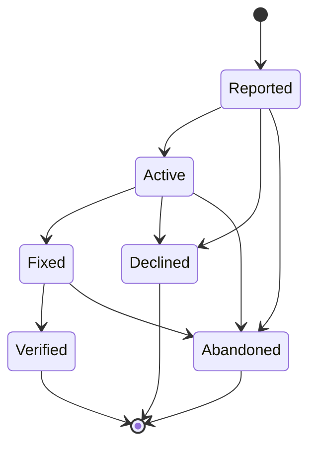

# Bug (BUG-NNN)

**Template:** [bug-template.md.template](bug-template.md.template)

A structured defect report that exists outside the Epic hierarchy. Bugs capture problems discovered during any phase of work — testing, user feedback, agent observation — that don't naturally fit as children of an existing Epic. They bridge spec-management (where the problem is described) and execution-tracking (where the fix is tracked).

- **Format:** Single markdown file at `docs/bug/<Phase>/(BUG-NNN)-<Title>.md` — placed in a subdirectory matching its current lifecycle phase. Phase subdirectories: `Reported/`, `Active/`, `Fixed/`, `Verified/`, `Declined/`. (Lightweight, like User Stories.)
  - Example: `docs/bug/Reported/(BUG-001)-Null-Ref-On-Missing-Title.md`
  - When transitioning phases, **move the file** to the new phase directory (e.g., `git mv docs/bug/Reported/(BUG-001)-Foo.md docs/bug/Active/(BUG-001)-Foo.md`).
- **Triage at creation:** Severity, affected artifacts, and priority are frontmatter fields set at creation time, not a separate phase.
- **Tracking requirement:** All Bugs carry `execution-tracking: required` in frontmatter. When a Bug comes up for implementation (typically at Reported → Active), invoke the execution-tracking skill to create a tracked plan before writing the fix. The Bug's `fix-ref` field records the execution-tracking plan or task ID (see SKILL.md § Execution tracking handoff).
- A Bug is "Verified" when the fix has been confirmed working (terminal success). "Declined" for intentional non-action (wontfix / by-design). "Abandoned" for issues that are no longer relevant.
- Bugs are independent: they reference affected artifacts via `affected-artifacts` but sit outside the hierarchy.
