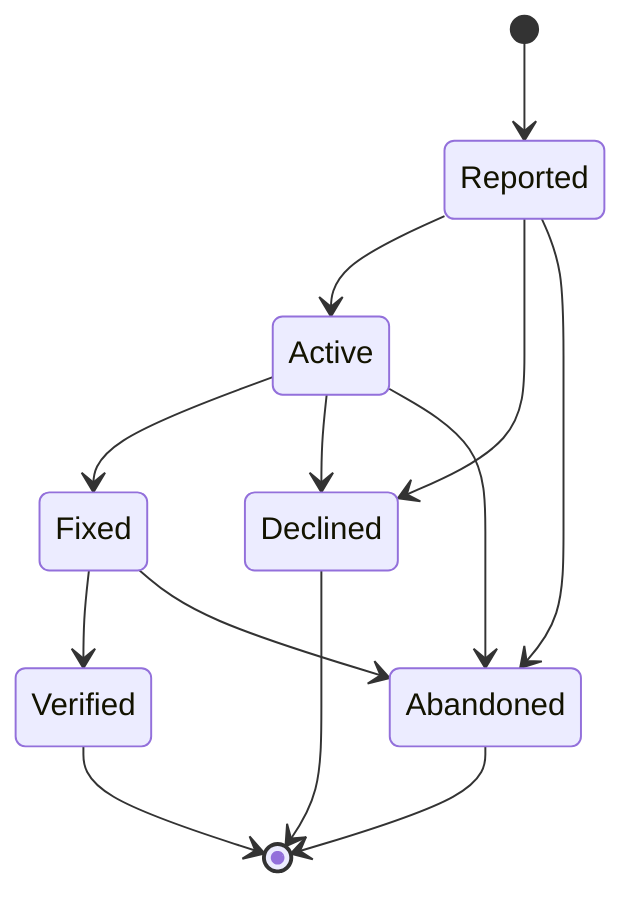

# Bug (BUG-NNN)

**Template:** [bug-template.md.j2](bug-template.md.j2)

A structured defect report that exists outside the Epic hierarchy. Bugs capture problems discovered during any phase of work — testing, user feedback, agent observation — that don't naturally fit as children of an existing Epic. They bridge spec-management (where the problem is described) and execution-tracking (where the fix is tracked).

- **Format:** Single markdown file at `docs/bug/(BUG-NNN)-<Title>.md` (lightweight, like User Stories).
- **Triage at creation:** Severity, affected artifacts, and priority are frontmatter fields set at creation time, not a separate phase.
- **Handoff to execution-tracking:** Occurs at the Reported → Active transition. The Bug's `fix-ref` field records the execution-tracking plan or task ID.
- A Bug is "Verified" when the fix has been confirmed working (terminal success). "Declined" for intentional non-action (wontfix / by-design). "Abandoned" for issues that are no longer relevant.
- Bugs are independent: they reference affected artifacts via `affected-artifacts` but sit outside the hierarchy.
