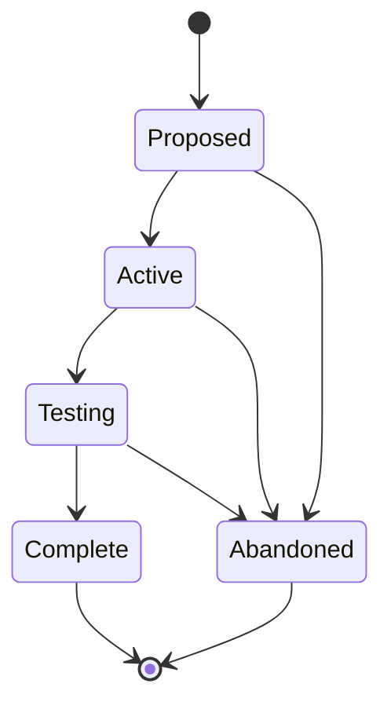

# Epics (EPIC-NNN)

**Template:** [epic-template.md.template](epic-template.md.template)

A strategic initiative that decomposes into multiple Agent Specs, Spikes, and ADRs. The **coordination layer** between product vision and feature-level work.

- An Epic is "Complete" when all child Agent Specs reach "Implemented" and success criteria are met.
- Epics can trace back to journey pain points via `addresses:` in frontmatter (list of `JOURNEY-NNN.PP-NN` IDs). This is informational — it records which pain points the Epic was created to resolve.
