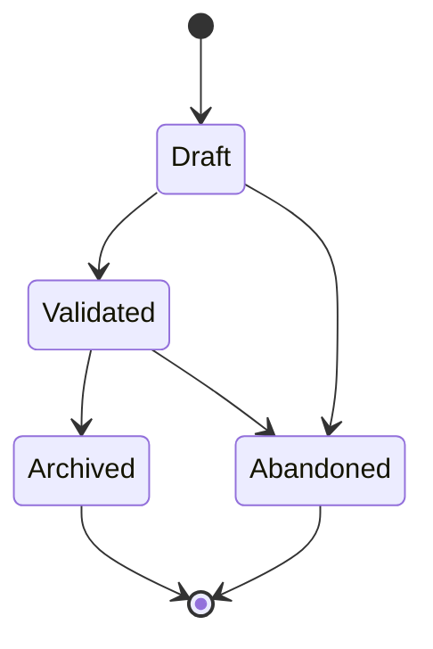

# Personas (PERSONA-NNN)

**Template:** [persona-template.md.template](persona-template.md.template)

A user archetype that represents a distinct segment of the product's audience. Follow **Alan Cooper's persona model** (from *The Inmates Are Running the Asylum*): a Persona is a concrete, narrative description of a fictional but realistic user — defined by goals, behaviors, and context, not demographics alone. Personas are cross-cutting — they are referenced by Journeys, Stories, Visions, and other artifacts but are not owned by any single one.

- **Folder structure:** `docs/persona/<Phase>/(PERSONA-NNN)-<Title>/` — the Persona folder lives inside a subdirectory matching its current lifecycle phase. Phase subdirectories: `Draft/`, `Validated/`, `Archived/`.
  - Example: `docs/persona/Validated/(PERSONA-001)-Solo-Developer/`
  - When transitioning phases, **move the folder** to the new phase directory (e.g., `git mv docs/persona/Draft/(PERSONA-001)-Foo/ docs/persona/Validated/(PERSONA-001)-Foo/`).
  - Primary file: `(PERSONA-NNN)-<Title>.md` — the persona definition.
  - Supporting docs: interview notes, survey data, behavioral research, demographic analysis.
- A Persona is "Validated" when its attributes have been confirmed through user research, interviews, or data analysis — not just assumed.
- Personas are *reference artifacts* — they inform Journey, Story, and Agent Spec creation but are not directly implemented. They do NOT contain acceptance criteria, task breakdowns, or feature specifications.
