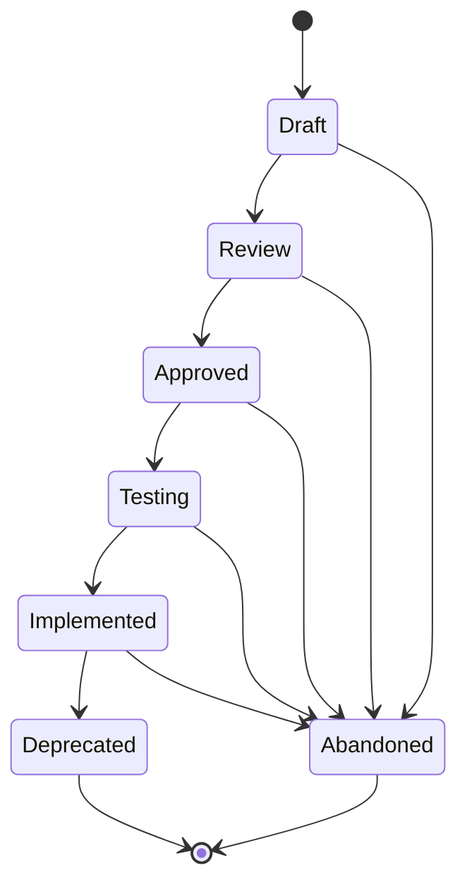

# Agent Specs (SPEC-NNN)

**Template:** [spec-template.md.template](spec-template.md.template)

Follow **spec-driven development** principles: an Agent Spec is a behavior contract — precise enough for an agent to create an implementation plan from, but concise enough to scan in a single pass. It defines external behavior (inputs, outputs, preconditions, constraints), not exhaustive requirements. Supplemental detail comes from child Stories and linked research.

- **Folder structure:** `docs/spec/<Phase>/(SPEC-NNN)-<Title>/` — the Spec folder lives inside a subdirectory matching its current lifecycle phase. Phase subdirectories: `Draft/`, `Review/`, `Approved/`, `Testing/`, `Implemented/`, `Deprecated/`.
  - Example: `docs/spec/Approved/(SPEC-002)-Widget-Factory/`
  - When transitioning phases, **move the folder** to the new phase directory (e.g., `git mv docs/spec/Draft/(SPEC-002)-Foo/ docs/spec/Review/(SPEC-002)-Foo/`).
  - Primary file: `(SPEC-NNN)-<Title>.md` — the spec document itself.
  - Supporting docs live alongside it in the same folder.
- Should be scoped to something a team (or agent) can ship and validate independently.
