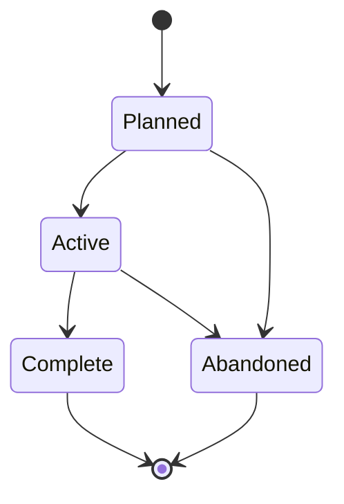

# Research Spikes (SPIKE-NNN)

**Template:** [spike-template.md.template](spike-template.md.template)

A time-boxed investigation to reduce uncertainty before committing to a path. Follow **Kent Beck's spike concept** (from *Extreme Programming Explained*): a Spike is a short, focused experiment that answers a specific technical or design question — it produces *knowledge*, not shippable code. When sensible, use an agent (with a separate worktree, if necessary) to explore multiple candidates from within the spike simultaneously.

- **Folder structure:** `docs/research/<Phase>/(SPIKE-NNN)-<Title>/` — the Spike folder lives inside a subdirectory matching its current lifecycle phase. Phase subdirectories: `Planned/`, `Active/`, `Complete/`.
  - Example: `docs/research/Active/(SPIKE-001)-Mermaid-Rendering-Options/`
  - When transitioning phases, **move the folder** to the new phase directory (e.g., `git mv docs/research/Planned/(SPIKE-001)-Foo/ docs/research/Active/(SPIKE-001)-Foo/`).
  - Primary file: `(SPIKE-NNN)-<Title>.md` (explicitly NOT `README.md`) — the spike document.
  - Supporting docs: research artifacts, experiment results.
- Number in intended execution order — sequence communicates priority.
- Gating spikes must define go/no-go criteria with measurable thresholds (not just "investigate X").
- Gating spikes must recommend a specific pivot if the gate fails (not just "reconsider approach").
- Spikes can belong to any artifact type (Vision, Epic, Agent Spec, ADR, Persona). The owning artifact controls all spike tables: questions, risks, gate criteria, dependency graph, execution order, phase mappings, and risk coverage. There is no separate research roadmap document.
