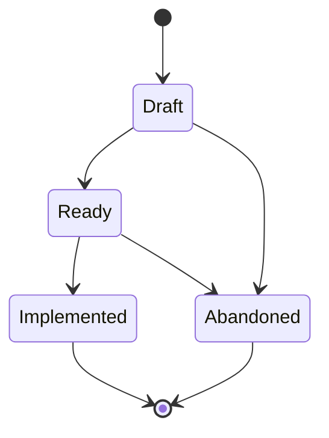

# User Story (STORY-NNN)

**Template:** [story-template.md.template](story-template.md.template)

The atomic unit of user-facing requirements. Follow **Mike Cohn's user story model** (from *User Stories Applied*): a Story captures a single capability from the user's perspective in the "As a / I want / so that" format with clear acceptance criteria. Stories should satisfy the **INVEST** criteria — Independent, Negotiable, Valuable, Estimable, Small, Testable. Decomposes an Epic into verifiable, implementable increments.

- **Format:** Single markdown file at `docs/story/(STORY-NNN)-<Title>.md`.
- Stories should be small enough to implement and verify independently. If a story requires multiple Agent Specs, it is likely scoped too broadly (should be an Epic).
- A Story is "Ready" when acceptance criteria are defined and agreed upon. A Story is "Implemented" when all acceptance criteria pass.
