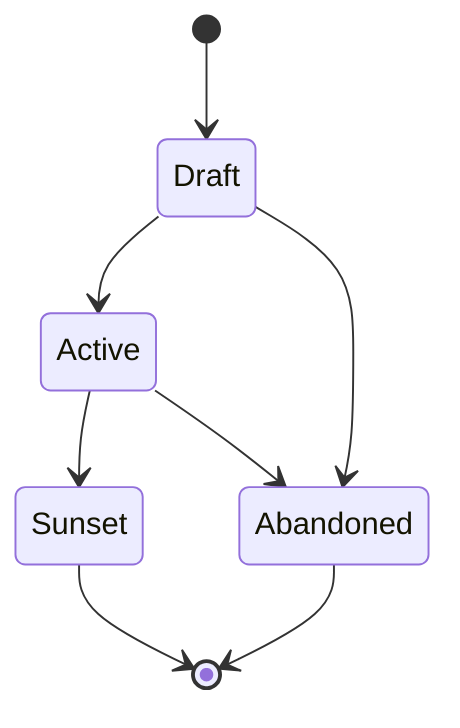

# Product Vision (VISION-NNN)

**Template:** [vision-template.md.template](vision-template.md.template)

The highest-level specification artifact. Follow **Marty Cagan's product vision model** (from *Inspired*): a Vision is a short, aspirational narrative describing the future you want to create for your customers. It communicates *why* the product exists, *who* it serves, and *what better state of the world* it enables — and nothing else.

A Vision is NOT a spec, NOT a feature list, NOT a roadmap, NOT a technical architecture document, and NOT a tracking artifact. If content describes *how* the system is built, *what* technologies it uses, *when* things ship, or *which tasks* remain, it belongs in a child artifact (Epic, Agent Spec, ADR, Spike), not the Vision.

- **Folder structure:** `docs/vision/<Phase>/(VISION-NNN)-<Title>/` — the Vision folder lives inside a subdirectory matching its current lifecycle phase. Phase subdirectories: `Draft/`, `Active/`, `Sunset/`.
  - Example: `docs/vision/Active/(VISION-001)-Personal-Agent-Platform/`
  - When transitioning phases, **move the folder** to the new phase directory (e.g., `git mv docs/vision/Draft/(VISION-001)-Foo/ docs/vision/Active/(VISION-001)-Foo/`).
  - Primary file: `(VISION-NNN)-<Title>.md` — the vision document itself.
  - Supporting docs live alongside it in the same folder. These are NOT numbered artifacts — they are informal reference material owned by the Vision.
    - **Expected:** Every Vision SHOULD include an `architecture-overview.md` and a `roadmap.md`. These are the primary supporting docs that give the Vision operational substance.
    - **Optional:** competitive analysis, market research, positioning docs, persona summaries, and other reference material as needed.
- **Architecture overview:** An `architecture-overview.md` in the Vision folder describes *how the system works holistically* — a living description of the system shape. It is descriptive, not decisional. Individual architectural *decisions* ("we chose X over Y because Z") belong in ADRs. When extracting architecture content from a Vision document, split it: the holistic description stays as a Vision supporting doc; discrete decisions with alternatives considered become ADRs.
- **Roadmap:** A `roadmap.md` in the Vision folder organizes child Epics into a sequenced plan. It is prescriptive when initialized — capturing planned Epic order and dependencies — but becomes descriptive as the project progresses: update it to reflect actual Epic phases whenever Epics transition. Include a Mermaid diagram (gantt or graph) for visual sequencing and a status table listing each Epic's current phase, one-line goal, and dependencies on other Epics. The roadmap shows *sequence and dependencies*, not calendar dates or timeline commitments. Detailed task-level tracking belongs in implementation plans (via execution-tracking).
- Should be stable — update infrequently. If a Vision needs frequent revision, it is likely scoped too narrowly (should be an Epic) or too early (needs a Spike first).
- Should fit on roughly one page. If a Vision is growing beyond that, extract detail into supporting docs or child artifacts.
- Vision documents do NOT contain: implementation details, technical analysis, timelines, task breakdowns, tracking tables, dependency graphs, or phase-by-phase rollout plans.
