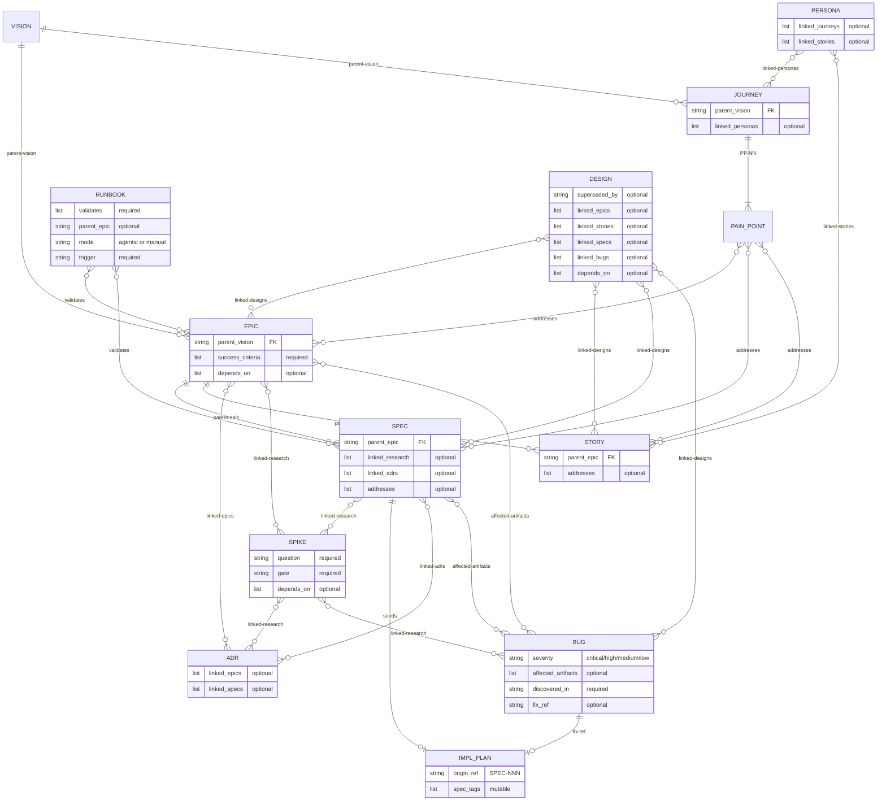

# Spec Management

This skill defines the canonical artifact types, phases, and hierarchy. The ER diagram below is the relationship summary; detailed definitions and templates live in `references/`. If the host repo has an AGENTS.md, keep its artifact sections in sync with the skill's reference data.

## Artifact relationship model



**Key:** Solid lines (`||--o{`) = mandatory hierarchy. Diamond lines (`}o--o{`) = informational cross-references. SPIKE can attach to any artifact type, not just SPEC. Any artifact can declare `depends-on:` blocking dependencies on any other artifact.

## Stale reference watcher

The `specwatch.sh` script monitors `docs/` for stale references. It checks two things:

1. **Markdown link paths** — `[text](path/to/file.md)` links where the target no longer exists. Suggests corrections by artifact ID lookup.
2. **Frontmatter artifact references** — all `depends-on`, `parent-*`, `linked-*`, `addresses`, `validates`, `affected-artifacts`, `superseded-by`, and `fix-ref` fields. For each artifact ID, resolves to a relative file path and checks both existence and semantic coherence (target in Abandoned/Rejected state, phase mismatches where the source is significantly more advanced than the target).

**Script location:** `scripts/specwatch.sh` (relative to this skill)

**Subcommands:**

| Command | What it does |
|---------|-------------|
| `scan` | Run a full stale-reference scan (no watcher needed) |
| `watch` | Start background filesystem watcher (requires `fswatch`) |
| `stop` | Stop a running watcher |
| `status` | Show watcher status and log summary |
| `touch` | Refresh the sentinel keepalive timer |

**Log format:** Findings are written to `.agents/specwatch.log` in a structured format. This file is a runtime artifact — add `specwatch.log` to your `.gitignore` if it isn't already.
```
STALE <source-file>:<line>
  broken: <relative-path-as-written>
  found: <suggested-new-path>
  artifact: <TYPE-NNN>

STALE_REF <source-file>:<line> (frontmatter)
  field: <frontmatter-field-name>
  target: <TYPE-NNN>
  resolved: NONE
  issue: unresolvable artifact ID

WARN <source-file>:<line> (frontmatter)
  field: <frontmatter-field-name>
  target: <TYPE-NNN>
  resolved: <relative-path-to-target>
  issue: <target is Abandoned | source is X but target is still Y>
```

### Post-operation scan

After every artifact operation (create, edit, transition, audit), run `scripts/specwatch.sh scan` to catch any stale references introduced by the changes. If `.agents/specwatch.log` reports stale references, surface them as warnings and fix them before committing. The scan has no external dependencies — it uses only Python 3 and the filesystem.

The background `watch` mode (requires `fswatch`) is available for long-running sessions but is not part of the default workflow.

## Dependency graph

The `specgraph.sh` script builds and queries the artifact dependency graph from frontmatter. It caches a JSON graph in `/tmp/` and auto-rebuilds when any `docs/*.md` file changes.

**Script location:** `scripts/specgraph.sh` (relative to this skill)

**Subcommands:**

| Command | What it does |
|---------|-------------|
| `overview` | **Default.** Hierarchy tree with status indicators + execution tracking |
| `build` | Force-rebuild graph from frontmatter |
| `blocks <ID>` | What does this artifact depend on? (direct dependencies) |
| `blocked-by <ID>` | What depends on this artifact? (inverse lookup) |
| `tree <ID>` | Transitive dependency tree (all ancestors) |
| `ready` | Active/Planned artifacts with all deps resolved |
| `next` | What to work on next (ready items + what they unblock, blocked items + what they need) |
| `mermaid` | Mermaid diagram to stdout |
| `status` | Summary table by type and phase |

Run `blocks <ID>` before phase transitions to verify dependencies are resolved. Run `ready` to find unblocked work. Run `tree <ID>` for transitive dependency chains.

## Lifecycle table format

Every artifact embeds a lifecycle table tracking phase transitions:

```markdown
### Lifecycle

| Phase | Date | Commit | Notes |
|-------|------|--------|-------|
| Planned | 2026-02-24 | abc1234 | Initial creation |
| Active  | 2026-02-25 | def5678 | Dependency X satisfied |
```

Commit hashes reference the repo state at the time of the transition, not the commit that writes the hash stamp itself. Commit the transition first, then stamp the resulting hash into the lifecycle table and index in a second commit. This keeps the stamped hash reachable in git history.

## Index maintenance

Every doc-type directory keeps a single lifecycle index (`list-<type>.md`). **Refreshing the index is the final step of every artifact operation** — creation, content edits, phase transitions, and abandonment. No artifact change is complete until the index reflects it.

### What "refresh" means

1. Read (or create) `docs/<type>/list-<type>.md`.
2. Ensure one table per active lifecycle phase, plus a table for each end-of-life phase that has entries.
3. For the affected artifact, update its row: title, current phase, last-updated date, and commit hash of the change.
4. If the artifact moved phases, remove it from the old phase table and add it to the new one.
5. Sort rows within each table by artifact number.

### When to refresh

| Operation | Trigger |
|-----------|---------|
| Create artifact | New row in the appropriate phase table |
| Edit artifact content or frontmatter | Update last-updated date and commit hash |
| Transition phase | Move row between phase tables |
| Abandon / end-of-life | Move row to the end-of-life table |

This rule is referenced as the **index refresh step** in the workflows below. Do not skip it.

## Auditing artifacts

Audits touch every artifact, so **always parallelize with sub-agents** — serial auditing is too slow and misses the cross-cutting checks that only make sense when run together. Spawn four agents in a single turn:

| Agent | Responsibility |
|-------|---------------|
| **Lifecycle auditor** | Check every artifact in `docs/` for valid status field, lifecycle table with hash stamps, and matching row in the appropriate `list-<type>.md` index. |
| **Cross-reference checker** | Verify all `parent-*`, `depends-on`, `linked-*`, and `addresses` frontmatter values resolve to existing artifact files. Flag dangling references. |
| **Naming & structure validator** | Confirm directory/file names follow `(TYPE-NNN)-Title` convention, templates have required frontmatter fields, and folder-type artifacts contain a primary `.md` file. |
| **Phase/folder alignment** | Run `specwatch.sh phase-fix` to detect and move artifacts whose frontmatter `status:` doesn't match their phase subdirectory. Review the staged `git mv` renames and commit. |
| **Dependency coherence auditor** | Validate that `depends-on` edges are logically sound, not just syntactically valid. See checks below. |

The dependency coherence auditor catches cases where the graph *exists* but is *wrong*. The cross-reference checker confirms targets resolve to real files; this agent checks whether those edges still make sense. Specific checks:

1. **Dead-end dependencies** — `depends-on` targets an Abandoned or Rejected artifact. The dependency can never be satisfied; flag it for removal or replacement.
2. **Orphaned satisfied dependencies** — `depends-on` targets a Complete/Implemented artifact but the dependent is still in Draft/Proposed. The blocker is resolved — is the dependent actually stalled for a different reason, or should it advance?
3. **Phase-inversion** — A dependent artifact is in a *later* lifecycle phase than something it supposedly depends on (e.g., an Implemented spec that `depends-on` a Draft spike). This suggests the edge was never cleaned up or was added in error.
4. **Content-drift** — Read both artifacts and assess whether the dependency relationship still holds given what each artifact actually describes. Artifacts evolve; an edge that made sense at creation time may no longer reflect reality. Flag edges where the content of the two artifacts has no apparent logical connection.
5. **Missing implicit dependencies** — Scan artifact bodies for references to other artifact IDs (e.g., "as decided in ADR-001" or "builds on SPIKE-003") that are *not* declared in `depends-on` or `linked-*` frontmatter. These are shadow dependencies that should be formalized or explicitly noted as informational.

For checks 4 and 5, the agent must actually read artifact content — frontmatter alone is not sufficient. Present findings as a table with: source artifact, target artifact, check type, evidence (quote or summary), and recommended action (remove edge, add edge, update frontmatter, or investigate).

Each agent reports gaps as a structured table with file path, issue type, and missing/invalid field. Merge the tables into a single audit report. Always include a 1-2 sentence summary of each artifact (not just its title) in result tables.

**Enforce definitions, not current layout.** The artifact definition files (in `references/`) are the source of truth for folder structure. If the repo's current layout diverges from the definitions (e.g., epics in a flat directory instead of phase subdirectories), the audit should flag misplaced files and propose `git mv` commands to bring them into compliance. Do not silently adopt a non-standard layout just because it already exists.

## Status overview

When the user asks for status, progress, or "what's next?", **default to showing both swain-design and swain-do layers** unless they specifically ask for only one. The `overview` command is the single entry point.

### `specgraph.sh overview` (primary — use this by default)

Renders a hierarchy tree in the terminal showing every artifact with its status, blocking dependencies, and swain-do progress:

```
  ✓ VISION-001: Personal Agent Patterns [Active]
  ├── → EPIC-007: Spec Management System [Active]
  │   ├── ✓ SPEC-001: Artifact Lifecycle [Implemented]
  │   ├── ✓ SPEC-002: Dependency Graph [Implemented]
  │   └── → SPEC-003: Cross-reference Validation [Draft]
  │         ↳ blocked by: SPIKE-002
  └── → EPIC-008: Execution Tracking [Proposed]

── Cross-cutting ──
  ├── → ADR-001: Graph Storage Format [Adopted]
  └── → PERSONA-001: Solo Developer [Validated]

── Execution Tracking ──
  (bd status output here)
```

**Status indicators:** `✓` = resolved (Complete/Implemented/Adopted/etc.), `→` = active/in-progress. Blocked dependencies show inline with `↳ blocked by:`. Cross-cutting artifacts (ADR, Persona, Runbook, Bug, Spike) appear in their own section. The swain-do tail calls `bd status` automatically.

**Display rule:** Present the `specgraph.sh overview` output verbatim — do not summarize, paraphrase, or reformat the tree. The script's output is already designed for human consumption. You may add a brief note after the output only if the user asked a specific question (e.g., "what should I work on next?").

### Other read-only commands

| Command | When to use |
|---------|-------------|
| `specgraph.sh status` | Flat summary table grouped by artifact type — useful for counts and phase distribution |
| `specgraph.sh next` | Ready items + what they'd unblock, blocked items + what they need — useful for deciding what to work on |
| `specgraph.sh mermaid` | Mermaid diagram to stdout — useful for documentation or visual export |

## Creating artifacts

### Error handling

When an operation fails (missing parent, number collision, script error, etc.), consult [references/troubleshooting.md](references/troubleshooting.md) for the recovery procedure. Do not improvise workarounds — the troubleshooting guide covers the known failure modes.

### Workflow

1. Scan `docs/<type>/` (recursively, across all phase subdirectories) to determine the next available number for the prefix.
2. **For VISION artifacts:** Before drafting, ask the user whether this is a **competitive product** or a **personal product**. The answer determines which template sections to include and shapes the entire downstream decomposition. See the vision definition for details on each product type.
3. Read the artifact's definition file and template from the lookup table below.
4. Create the artifact in the correct phase subdirectory (usually the first phase — e.g., `docs/epic/Proposed/`, `docs/spec/Draft/`). Create the phase directory with `mkdir -p` if it doesn't exist yet. See the definition file for the exact directory structure.
5. Populate frontmatter with the required fields for the type (see the template).
6. Initialize the lifecycle table with the appropriate phase and current date. This is usually the first phase (Draft, Planned, etc.), but an artifact may be created directly in a later phase if it was fully developed during the conversation (see [Phase skipping](#phase-skipping)).
7. Validate parent references exist (e.g., the Epic referenced by a new Agent Spec must already exist).
8. **Index refresh step** — update `list-<type>.md` (see [Index maintenance](#index-maintenance)).

### Artifact type definitions

Each artifact type has a definition file (lifecycle phases, conventions, folder structure) and a template (frontmatter fields, document skeleton). **Read the definition for the artifact type you are creating or transitioning.**

| Type | Definition | Template |
|------|-----------|----------|
| Product Vision (VISION-NNN) | [references/vision-definition.md](references/vision-definition.md) | [references/vision-template.md.template](references/vision-template.md.template) |
| User Journey (JOURNEY-NNN) | [references/journey-definition.md](references/journey-definition.md) | [references/journey-template.md.template](references/journey-template.md.template) |
| Epic (EPIC-NNN) | [references/epic-definition.md](references/epic-definition.md) | [references/epic-template.md.template](references/epic-template.md.template) |
| User Story (STORY-NNN) | [references/story-definition.md](references/story-definition.md) | [references/story-template.md.template](references/story-template.md.template) |
| Agent Spec (SPEC-NNN) | [references/spec-definition.md](references/spec-definition.md) | [references/spec-template.md.template](references/spec-template.md.template) |
| Research Spike (SPIKE-NNN) | [references/spike-definition.md](references/spike-definition.md) | [references/spike-template.md.template](references/spike-template.md.template) |
| Persona (PERSONA-NNN) | [references/persona-definition.md](references/persona-definition.md) | [references/persona-template.md.template](references/persona-template.md.template) |
| ADR (ADR-NNN) | [references/adr-definition.md](references/adr-definition.md) | [references/adr-template.md.template](references/adr-template.md.template) |
| Runbook (RUNBOOK-NNN) | [references/runbook-definition.md](references/runbook-definition.md) | [references/runbook-template.md.template](references/runbook-template.md.template) |
| Bug (BUG-NNN) | [references/bug-definition.md](references/bug-definition.md) | [references/bug-template.md.template](references/bug-template.md.template) |

## Phase transitions

### Phase skipping

Phases listed in the artifact definition files are available waypoints, not mandatory gates. An artifact may skip intermediate phases and land directly on a later phase in the sequence. This is normal in single-user workflows where drafting and review happen conversationally in the same session.

- The lifecycle table records only the phases the artifact actually occupied — one row per state it landed on, not rows for states it skipped past.
- Skipping is forward-only: an artifact cannot skip backward in its phase sequence.
- **Abandoned** is a universal end-of-life phase available from any state, including Draft. It signals the artifact was intentionally not pursued. Use it instead of deleting artifacts — the record of what was considered and why it was dropped is valuable.
- Other end-of-life transitions (Sunset, Retired, Superseded, Archived, Deprecated) require the artifact to have been in an active state first — you cannot skip directly from Draft to Retired.

### Workflow

1. Validate the target phase is reachable from the current phase (same or later in the sequence; intermediate phases may be skipped).
2. **Move the artifact** to the new phase subdirectory using `git mv` (e.g., `git mv docs/epic/Proposed/(EPIC-001)-Foo/ docs/epic/Active/(EPIC-001)-Foo/`). Every artifact type uses phase subdirectories — see the artifact's definition file for the exact directory names.
3. Update the artifact's status field in frontmatter to match the new phase.
4. Commit the transition change (move + status update).
5. Append a row to the artifact's lifecycle table with the commit hash from step 4.
6. Commit the hash stamp as a **separate commit** — never amend. Two distinct commits keeps the stamped hash reachable in git history and avoids interactive-rebase pitfalls.
7. **Index refresh step** — move the artifact's row to the new phase table (see [Index maintenance](#index-maintenance)).

### Completion rules

- An Epic is "Complete" only when all child Agent Specs are "Implemented" and success criteria are met.
- An Agent Spec is "Implemented" only when its implementation plan is closed (or all tasks are done in fallback mode).
- An ADR is "Superseded" only when the superseding ADR is "Adopted" and links back.

## Execution tracking handoff

Artifact types fall into four tracking tiers based on their relationship to implementation work:

| Tier | Artifacts | Rule |
|------|-----------|------|
| **Implementation** | SPEC, STORY, BUG | Execution-tracking **must** be invoked when the artifact comes up for implementation — create a tracked plan before writing code |
| **Coordination** | EPIC, VISION, JOURNEY | Swain-design decomposes into implementable children first; swain-do runs on the children, not the container |
| **Research** | SPIKE | Execution-tracking is optional but recommended for complex spikes with multiple investigation threads |
| **Reference** | ADR, PERSONA, RUNBOOK | No execution tracking expected |

### The `swain-do` frontmatter field

Artifacts that need swain-do carry `swain-do: required` in their frontmatter. This field is:
- **Always present** on SPEC, STORY, and BUG artifacts (injected by their templates)
- **Added per-instance** on SPIKE artifacts when swain-design assesses the spike is complex enough to warrant tracked research
- **Never present** on EPIC, VISION, JOURNEY, ADR, PERSONA, or RUNBOOK artifacts — orchestration for those types lives in the skill, not the artifact

When an agent reads an artifact with `swain-do: required`, it should invoke the swain-do skill before beginning implementation work.

### What "comes up for implementation" means

The trigger is intent, not phase transition alone. An artifact comes up for implementation when the user or workflow indicates they want to start building — not merely when its status changes. When implementation begins, the resulting plan should follow TDD methodology (see [Implementation plans § TDD methodology](#tdd-methodology)) — tests derived from acceptance criteria are written before the code they verify.

- "Let's implement SPEC-003" → invoke swain-do with TDD-structured plan
- "Move SPEC-003 to Approved" → phase transition only, no tracking yet
- "Fix BUG-001" → invoke swain-do (write a failing regression test first, then fix)
- "Let's work on EPIC-008" → decompose into SPECs/STORYs first, then track the children

### Coordination artifact decomposition

When swain-do is requested on an EPIC, VISION, or JOURNEY:

1. **Swain-design leads.** Decompose the artifact into implementable children (SPECs, STORYs) if they don't already exist.
2. **Swain-do follows.** Create tracked plans for the child artifacts, not the container.
3. **Swain-design monitors.** The container transitions (e.g., EPIC → Complete) based on child completion per the existing completion rules.

### STORY and SPEC coordination

Under the same parent Epic, Stories define user-facing requirements and Specs define technical implementations. They connect through shared `addresses` pain-point references and their common parent Epic. When creating swain-do plans, tag tasks with both `spec:SPEC-NNN` and `story:STORY-NNN` labels when a task satisfies both artifacts.

### Superpowers integration

When superpowers (obra/superpowers) is installed, route implementation through its brainstorming → writing-plans pipeline to produce higher-quality plans before handing off to swain-do.

**Detection:** Check whether the `brainstorming` and `writing-plans` skills exist:

```bash
ls .claude/skills/brainstorming/SKILL.md .claude/skills/writing-plans/SKILL.md 2>/dev/null
```

If both exist, superpowers is available. If either is missing, use the current direct-to-swain-do flow.

**Routing when superpowers IS present:**

1. Invoke the `brainstorming` skill with the artifact's context — pass the problem statement, acceptance criteria, and scope from the artifact's frontmatter and body.
2. Brainstorming produces a design and invokes `writing-plans` automatically.
3. `writing-plans` saves a plan file to `docs/plans/YYYY-MM-DD-<feature-name>.md`.
4. After the plan file is saved, invoke swain-do's plan ingestion:
   ```bash
   python3 .claude/skills/swain-do/scripts/ingest-plan.py \
     docs/plans/<plan-file>.md <ARTIFACT-ID>
   ```
5. This creates a bd epic with child tasks, sequential dependencies, and spec lineage tags.

**Routing when superpowers is NOT present:**

Use the current flow — invoke swain-do directly for ad-hoc task breakdown.

**If the user rejects the brainstorming design:** Stop cleanly. No plan file is produced, no bd tasks are created. The user can either retry brainstorming or fall back to the direct flow.

**Superpowers is a recommended companion, not a hard dependency.** Never install it automatically or block implementation if it's missing.

## Implementation plans

Implementation plans bridge declarative specs (`docs/`) and execution tracking. They are not doc-type artifacts. All CLI operations are handled by the **swain-do** skill — invoke it to bootstrap the task backend before creating plans.

### TDD methodology

Implementation plans follow **test-driven development** as the default methodology. Every plan should structure tasks so that tests are written before the code they verify — the classic red-green-refactor cycle. This matters because tests written after implementation tend to confirm what was built rather than what was specified; writing tests first forces the plan to stay anchored to the acceptance criteria.

**Task ordering principles:**

1. **Test first.** For each functional unit, the plan should contain a test task *before* its implementation task. The test task writes a failing test derived from the artifact's acceptance criteria. The implementation task makes it pass.
2. **Small cycles.** Prefer many small red-green pairs over a single "write all tests" → "write all code" split. Each cycle should cover one acceptance criterion or one behavioral facet.
3. **Refactor explicitly.** When a cycle produces working but rough code, include a refactor task after the green phase. Not every cycle needs one — only when the implementation warrants cleanup.
4. **Integration tests bookend the plan.** Start with a skeleton integration test that exercises the end-to-end path (it will fail until the pieces exist). The final task verifies it passes.

When superpowers is present, the brainstorming step should produce a TDD-structured plan. When seeding manually, decompose the spec's acceptance criteria into red-green task pairs.

### Workflow

1. If superpowers is present, use the [superpowers integration](#superpowers-integration) flow to author the plan. Otherwise, seed manually from the spec's "Implementation Approach" section, structuring tasks as TDD cycles derived from acceptance criteria.
2. Create an implementation plan linked via an **origin ref** (e.g., `SPEC-003`). Create tasks with dependencies, each tagged with **spec tags** for originating specs. Order test-writing tasks before their corresponding implementation tasks.
3. When a task impacts additional specs, add spec tags and cross-plan dependencies.

### Closing the loop

- Progress lives in the execution backend, not the spec doc. Transition the spec to "Implemented" once the plan completes.
- Note cross-spec tasks in each affected artifact's lifecycle entry (e.g., "Implemented — shared serializer also covers SPEC-007").
- If execution reveals the spec is unworkable, the swain-do skill's escalation protocol flows control back to this skill for spec updates before re-planning.

### Fallback

If swain-do is unavailable, fall back to the agent's built-in todo system (`todo`, `in_progress`, `blocked`, `done`). Maintain lineage by including artifact IDs in task titles (e.g., `[SPEC-003] Add export endpoint`).
