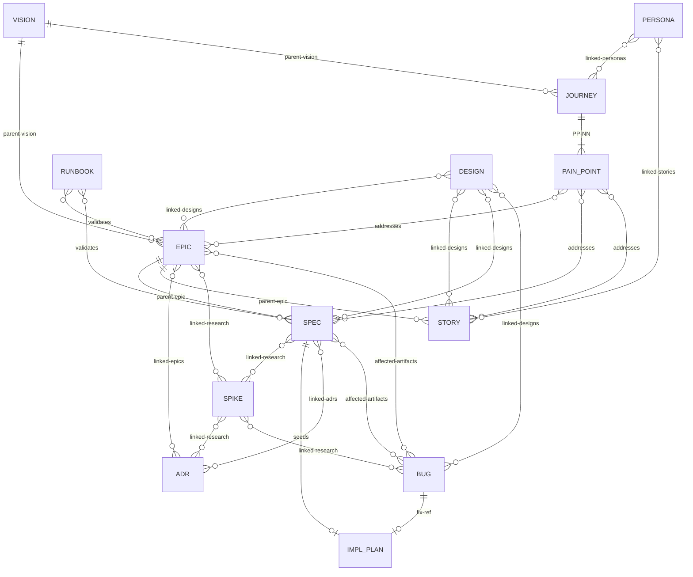

# Spec Management

This skill defines the canonical artifact types, phases, and hierarchy. Detailed definitions and templates live in `references/`. If the host repo has an AGENTS.md, keep its artifact sections in sync with the skill's reference data.

## Artifact type definitions

Each artifact type has a definition file (lifecycle phases, conventions, folder structure) and a template (frontmatter fields, document skeleton). **Read the definition for the artifact type you are creating or transitioning.**

| Type | What it is | Definition | Template |
|------|-----------|-----------|----------|
| Product Vision (VISION-NNN) | Top-level product direction — goals, audience, and success metrics for a competitive or personal product. | [definition](references/vision-definition.md) | [template](references/vision-template.md.template) |
| User Journey (JOURNEY-NNN) | End-to-end user workflow with pain points that drive epics and specs. | [definition](references/journey-definition.md) | [template](references/journey-template.md.template) |
| Epic (EPIC-NNN) | Large deliverable under a vision — groups related specs and stories with success criteria. | [definition](references/epic-definition.md) | [template](references/epic-template.md.template) |
| User Story (STORY-NNN) | User-facing requirement under an epic, written as "As a... I want... So that..." | [definition](references/story-definition.md) | [template](references/story-template.md.template) |
| Agent Spec (SPEC-NNN) | Technical implementation specification under an epic with acceptance criteria. | [definition](references/spec-definition.md) | [template](references/spec-template.md.template) |
| Research Spike (SPIKE-NNN) | Time-boxed investigation with a specific question and completion gate. | [definition](references/spike-definition.md) | [template](references/spike-template.md.template) |
| Persona (PERSONA-NNN) | Archetypal user profile that informs journeys and stories. | [definition](references/persona-definition.md) | [template](references/persona-template.md.template) |
| ADR (ADR-NNN) | Single architectural decision — context, choice, alternatives, and consequences (Nygard format). | [definition](references/adr-definition.md) | [template](references/adr-template.md.template) |
| Runbook (RUNBOOK-NNN) | Step-by-step operational procedure (agentic or manual) with a defined trigger. | [definition](references/runbook-definition.md) | [template](references/runbook-template.md.template) |
| Bug (BUG-NNN) | Defect report with severity, affected artifacts, and reproduction steps. | [definition](references/bug-definition.md) | [template](references/bug-template.md.template) |
| Design (DESIGN-NNN) | UI/UX interaction design — wireframes, flows, and state diagrams for user-facing surfaces. | [definition](references/design-definition.md) | [template](references/design-template.md.template) |

## Creating artifacts

### Error handling

When an operation fails (missing parent, number collision, script error, etc.), consult [references/troubleshooting.md](references/troubleshooting.md) for the recovery procedure. Do not improvise workarounds — the troubleshooting guide covers the known failure modes.

### Workflow

1. Scan `docs/<type>/` (recursively, across all phase subdirectories) to determine the next available number for the prefix.
2. **For VISION artifacts:** Before drafting, ask the user whether this is a **competitive product** or a **personal product**. The answer determines which template sections to include and shapes the entire downstream decomposition. See the vision definition for details on each product type.
3. Read the artifact's definition file and template from the lookup table above.
4. Create the artifact in the correct phase subdirectory (usually the first phase — e.g., `docs/epic/Proposed/`, `docs/spec/Draft/`). Create the phase directory with `mkdir -p` if it doesn't exist yet. See the definition file for the exact directory structure.
5. Populate frontmatter with the required fields for the type (see the template).
6. Initialize the lifecycle table with the appropriate phase and current date. This is usually the first phase (Draft, Planned, etc.), but an artifact may be created directly in a later phase if it was fully developed during the conversation (see [Phase skipping](#phase-skipping)).
7. Validate parent references exist (e.g., the Epic referenced by a new Agent Spec must already exist).
8. **ADR compliance check** — run `scripts/adr-check.sh <artifact-path>`. Review any findings with the user before proceeding.
9. **Post-operation scan** — run `scripts/specwatch.sh scan`. Fix any stale references before committing.
10. **Index refresh step** — update `list-<type>.md` (see [Index maintenance](#index-maintenance)).

## Phase transitions

### Phase skipping

Phases listed in the artifact definition files are available waypoints, not mandatory gates. An artifact may skip intermediate phases and land directly on a later phase in the sequence. This is normal in single-user workflows where drafting and review happen conversationally in the same session.

- The lifecycle table records only the phases the artifact actually occupied — one row per state it landed on, not rows for states it skipped past.
- Skipping is forward-only: an artifact cannot skip backward in its phase sequence.
- **Abandoned** is a universal end-of-life phase available from any state, including Draft. It signals the artifact was intentionally not pursued. Use it instead of deleting artifacts — the record of what was considered and why it was dropped is valuable.
- Other end-of-life transitions (Sunset, Retired, Superseded, Archived, Deprecated) require the artifact to have been in an active state first — you cannot skip directly from Draft to Retired.

### Workflow

1. Validate the target phase is reachable from the current phase (same or later in the sequence; intermediate phases may be skipped).
2. **Move the artifact** to the new phase subdirectory using `git mv` (e.g., `git mv docs/epic/Proposed/(EPIC-001)-Foo/ docs/epic/Active/(EPIC-001)-Foo/`). Every artifact type uses phase subdirectories — see the artifact's definition file for the exact directory names.
3. Update the artifact's status field in frontmatter to match the new phase.
4. **ADR compliance check** — for transitions to active phases (Active, Approved, Ready, Implemented, Adopted), run `scripts/adr-check.sh <artifact-path>`. Review any findings with the user before committing.
4a. **Verification gate (SPEC only)** — for `Testing → Implemented` transitions, run `scripts/spec-verify.sh <artifact-path>`. The script checks that every acceptance criterion has documented evidence in the Verification table. Address gaps before proceeding. See `spec-definition.md § Testing phase` for details.
5. Commit the transition change (move + status update).
6. Append a row to the artifact's lifecycle table with the commit hash from step 5.
7. Commit the hash stamp as a **separate commit** — never amend. Two distinct commits keeps the stamped hash reachable in git history and avoids interactive-rebase pitfalls.
8. **Post-operation scan** — run `scripts/specwatch.sh scan`. Fix any stale references.
9. **Index refresh step** — move the artifact's row to the new phase table (see [Index maintenance](#index-maintenance)).

### Completion rules

- An Epic is "Complete" only when all child Agent Specs are "Implemented" and success criteria are met.
- An Agent Spec is "Implemented" only when its implementation plan is closed (or all tasks are done in fallback mode) **and** its Verification table confirms all acceptance criteria pass (enforced by `spec-verify.sh`).
- An ADR is "Superseded" only when the superseding ADR is "Adopted" and links back.

## Evidence pool integration

When research-heavy artifacts enter their active/research phase, check for existing evidence pools and offer to create or reuse one.

### Research phase hook

This hook fires during phase transitions for these artifact types:

| Artifact | Trigger phase | When to check |
|----------|--------------|---------------|
| **Spike** | Planned → Active | Investigation is starting — evidence is most valuable here |
| **ADR** | Draft → Proposed | Decision needs supporting evidence |
| **Vision** | At creation | Market research and landscape analysis |
| **Epic** | At creation or Proposed → Active | Scoping benefits from prior research |

When the trigger fires:

1. Scan `docs/evidence-pools/*/manifest.yaml` for pools whose tags overlap with the artifact's topic (infer tags from the artifact title, keywords, and linked artifacts).
2. If matching pools exist, present them:
   > Found N evidence pool(s) that may be relevant:
   > - `websocket-vs-sse` (5 sources, refreshed 2026-03-01) — tags: real-time, websocket, sse
   >
   > Link an existing pool, create a new one, or skip?
3. If no matches: "No existing evidence pools match this topic. Want to create one with swain-search?"
4. If the user wants a pool, invoke the **swain-search** skill (via the Skill tool) to create or extend one.
5. After the pool is committed, update the artifact's `evidence-pool` frontmatter field with `<pool-id>@<commit-hash>`.

### Back-link maintenance

When an artifact's `evidence-pool` frontmatter is set or changed:

1. Read the pool's `manifest.yaml`
2. Add or update the `referenced-by` entry for this artifact:
   ```yaml
   referenced-by:
     - artifact: SPIKE-001
       commit: abc1234
   ```
3. Write the updated manifest

This keeps the pool's manifest in sync with which artifacts depend on it. Back-links enable evidencewatch to detect when a pool is no longer referenced and can be archived.

## Execution tracking handoff

Artifact types fall into four tracking tiers based on their relationship to implementation work:

| Tier | Artifacts | Rule |
|------|-----------|------|
| **Implementation** | SPEC, STORY, BUG | Execution-tracking **must** be invoked when the artifact comes up for implementation — create a tracked plan before writing code |
| **Coordination** | EPIC, VISION, JOURNEY | Swain-design decomposes into implementable children first; swain-do runs on the children, not the container |
| **Research** | SPIKE | Execution-tracking is optional but recommended for complex spikes with multiple investigation threads |
| **Reference** | ADR, PERSONA, RUNBOOK, DESIGN | No execution tracking expected |

### The `swain-do` frontmatter field

Artifacts that need swain-do carry `swain-do: required` in their frontmatter. This field is:
- **Always present** on SPEC, STORY, and BUG artifacts (injected by their templates)
- **Added per-instance** on SPIKE artifacts when swain-design assesses the spike is complex enough to warrant tracked research
- **Never present** on EPIC, VISION, JOURNEY, ADR, PERSONA, RUNBOOK, or DESIGN artifacts — orchestration for those types lives in the skill, not the artifact

When an agent reads an artifact with `swain-do: required`, it should invoke the swain-do skill before beginning implementation work.

### What "comes up for implementation" means

The trigger is intent, not phase transition alone. An artifact comes up for implementation when the user or workflow indicates they want to start building — not merely when its status changes.

- "Let's implement SPEC-003" → invoke swain-do
- "Move SPEC-003 to Approved" → phase transition only, no tracking yet
- "Fix BUG-001" → invoke swain-do
- "Let's work on EPIC-008" → decompose into SPECs/STORYs first, then track the children

### Coordination artifact decomposition

When swain-do is requested on an EPIC, VISION, or JOURNEY:

1. **Swain-design leads.** Decompose the artifact into implementable children (SPECs, STORYs) if they don't already exist.
2. **Swain-do follows.** Create tracked plans for the child artifacts, not the container.
3. **Swain-design monitors.** The container transitions (e.g., EPIC → Complete) based on child completion per the existing completion rules.

### STORY and SPEC coordination

Under the same parent Epic, Stories define user-facing requirements and Specs define technical implementations. They connect through shared `addresses` pain-point references and their common parent Epic. When creating swain-do plans, tag tasks with both `spec:SPEC-NNN` and `story:STORY-NNN` labels when a task satisfies both artifacts.

## Status overview

For project-wide status, progress, or "what's next?" queries, defer to the **swain-status** skill (it aggregates specgraph + bd + git + GitHub issues). For artifact-specific graph queries (blocks, tree, ready, mermaid), use `scripts/specgraph.sh` directly — see [references/specgraph-guide.md](references/specgraph-guide.md).

## Auditing artifacts

When the user requests an audit, read [references/auditing.md](references/auditing.md) for the full two-phase procedure (pre-scan + parallel audit agents including ADR compliance).

## Implementation plans

Implementation plans bridge declarative specs and execution tracking. When implementation begins, read [references/implementation-plans.md](references/implementation-plans.md) for TDD methodology, superpowers integration, plan workflow, and fallback procedures.

---

# Reference material

The sections below define formats and rules referenced by the workflows above. Consult them when a workflow step points here.

## Artifact relationship model



**Key:** Solid lines (`||--o{`) = mandatory hierarchy. Diamond lines (`}o--o{`) = informational cross-references. SPIKE can attach to any artifact type, not just SPEC. Any artifact can declare `depends-on:` blocking dependencies on any other artifact. Per-type frontmatter fields are defined in each type's template.

## Tooling

Three scripts support artifact workflows. Each is in `scripts/` relative to this skill.

| Script | Default command | Purpose |
|--------|----------------|---------|
| `specwatch.sh` | `scan` | Stale reference detection + artifact/bd sync check. Run after every artifact operation. If `.agents/specwatch.log` reports issues, fix before committing. For log format and subcommands, read [references/specwatch-guide.md](references/specwatch-guide.md). |
| `specgraph.sh` | `overview` | Dependency graph — hierarchy tree with status indicators. For subcommands and output interpretation, read [references/specgraph-guide.md](references/specgraph-guide.md). |
| `adr-check.sh` | `<artifact-path>` | ADR compliance — checks artifact against Adopted ADRs for relevance, dead refs to Retired/Superseded ADRs, and staleness. Exit 0 = clean, exit 1 = findings. If findings, read [references/adr-check-guide.md](references/adr-check-guide.md) for interpretation and content-level review procedure. |
| `spec-verify.sh` | `<artifact-path>` | Verification gate — checks a Spec's Verification table against its Acceptance Criteria. Gates `Testing → Implemented`. Exit 0 = all criteria covered, exit 1 = gaps or failures found, exit 2 = usage error. |

## Lifecycle table format

Every artifact embeds a lifecycle table tracking phase transitions:

```markdown
### Lifecycle

| Phase | Date | Commit | Notes |
|-------|------|--------|-------|
| Planned | 2026-02-24 | abc1234 | Initial creation |
| Active  | 2026-02-25 | def5678 | Dependency X satisfied |
```

Commit hashes reference the repo state at the time of the transition, not the commit that writes the hash stamp itself. Commit the transition first, then stamp the resulting hash into the lifecycle table and index in a second commit. This keeps the stamped hash reachable in git history.

## Index maintenance

Every doc-type directory keeps a single lifecycle index (`list-<type>.md`). **Refreshing the index is the final step of every artifact operation** — creation, content edits, phase transitions, and abandonment. No artifact change is complete until the index reflects it.

### What "refresh" means

1. Read (or create) `docs/<type>/list-<type>.md`.
2. Ensure one table per active lifecycle phase, plus a table for each end-of-life phase that has entries.
3. For the affected artifact, update its row: title, current phase, last-updated date, and commit hash of the change.
4. If the artifact moved phases, remove it from the old phase table and add it to the new one.
5. Sort rows within each table by artifact number.

### When to refresh

| Operation | Trigger |
|-----------|---------|
| Create artifact | New row in the appropriate phase table |
| Edit artifact content or frontmatter | Update last-updated date and commit hash |
| Transition phase | Move row between phase tables |
| Abandon / end-of-life | Move row to the end-of-life table |
