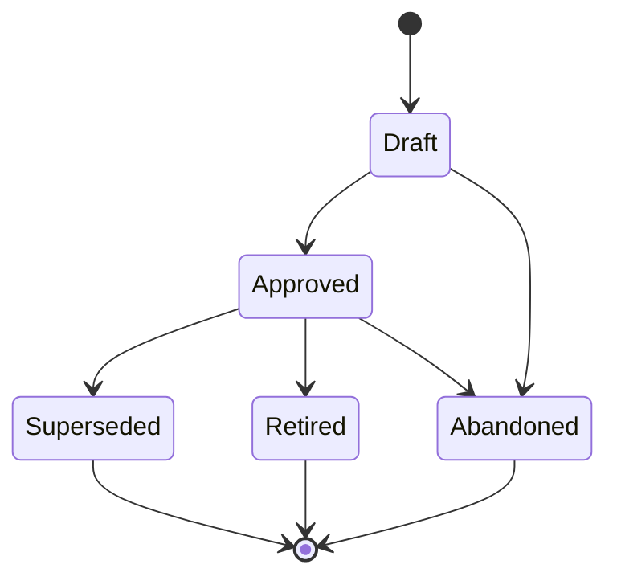

# Designs (DESIGN-NNN)

**Template:** [design-template.md.template](design-template.md.template)

A design artifact captures the interaction layer of a feature or system: screens, states, flows, wireframes, happy/sad paths, and UI decisions. Designs sit between Journeys (experience narratives) and Stories/Specs (implementation). They answer "what does the user see and do?" — not "how does the system work?" (Spec) or "what is the user's experience narrative?" (Journey).

- **Folder structure:** `docs/design/<Phase>/(DESIGN-NNN)-<Title>/` — always foldered because a single design may contain multiple document types (screen wireframes, flow diagrams, interactive mockup links, annotated screenshots).
  - Example: `docs/design/Approved/(DESIGN-003)-Skill-Installation-Flow/`
  - When transitioning phases, **move the folder** to the new phase directory (e.g., `git mv docs/design/Draft/(DESIGN-003)-Foo/ docs/design/Approved/(DESIGN-003)-Foo/`).
  - Phase subdirectories: `Draft/`, `Approved/`, `Retired/`, `Superseded/`.
  - Primary file: `(DESIGN-NNN)-<Title>.md` — the design overview and entry point.
  - Supporting docs: individual screen wireframes, flow diagrams, state machines, annotated mockups, prototype links, asset inventories.
- **Scoping rule:** One Design per cohesive interaction surface or workflow. "The skill installation flow" is a Design. "The settings page" is a Design. If a Design covers multiple unrelated interaction surfaces, it should be split. The artifact it's linked to sets the natural boundary — a Design linked to an Epic covers that Epic's interaction surface; a Design linked to a Story is narrower.
- Designs are *cross-cutting reference artifacts* — they link to Epics, Stories, Specs, and Bugs via `linked-designs` but are not owned by any single one. Multiple artifacts can reference the same Design.
- A Design is "Approved" when stakeholders agree it represents the intended interaction. "Superseded" when a newer Design replaces it (link via `superseded-by:` in frontmatter). "Retired" when the interaction surface it describes no longer exists.
- Designs are NOT Specs. They do not define API contracts, data models, or system behavior. If a Design starts accumulating technical implementation details, those belong in a Spec that references the Design.
