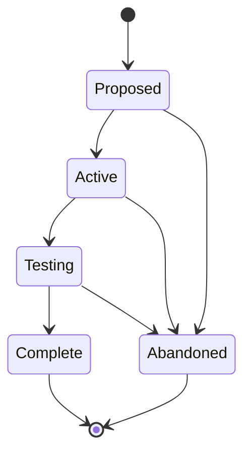

# Epics (EPIC-NNN)

**Template:** [epic-template.md.template](epic-template.md.template)

A strategic initiative that decomposes into multiple Agent Specs, Spikes, and ADRs. The **coordination layer** between product vision and feature-level work.

- **Folder structure:** `docs/epic/<Phase>/(EPIC-NNN)-<Title>/` — the Epic folder lives inside a subdirectory matching its current lifecycle phase. Phase subdirectories: `Proposed/`, `Active/`, `Testing/`, `Complete/`.
  - Example: `docs/epic/Active/(EPIC-001)-Spec-Management/`
  - When transitioning phases, **move the folder** to the new phase directory (e.g., `git mv docs/epic/Proposed/(EPIC-001)-Foo/ docs/epic/Active/(EPIC-001)-Foo/`).
  - Primary file: `(EPIC-NNN)-<Title>.md` — the epic document itself.
  - Supporting docs live alongside it in the same folder.
- An Epic is "Complete" when all child Agent Specs reach "Implemented" and success criteria are met.
- Epics can trace back to journey pain points via `addresses:` in frontmatter (list of `JOURNEY-NNN.PP-NN` IDs). This is informational — it records which pain points the Epic was created to resolve.
- **Tracking requirement:** Swain-do runs on child SPECs and STORYs, not on the Epic directly. If implementation is requested on an Epic, swain-design decomposes it into children first (see SKILL.md § Execution tracking handoff).
