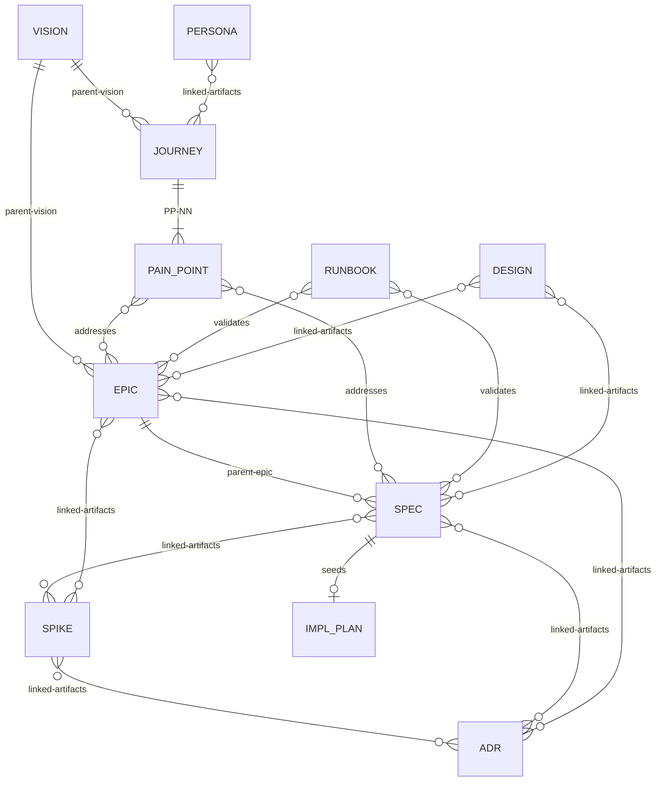

# Artifact Relationship Model

**9 artifact types in three lifecycle tracks:**

| Track | Types | Lifecycle |
|-------|-------|-----------|
| **Implementable** | SPEC | Proposed -> Ready -> In Progress -> Needs Manual Test -> Complete |
| **Container** | EPIC, SPIKE | Proposed -> Active -> Complete |
| **Standing** | VISION, JOURNEY, PERSONA, ADR, RUNBOOK, DESIGN | Proposed -> Active -> (Retired \| Superseded) |

**Universal terminal states** (available from any phase): Abandoned, Retired, Superseded.

**Key:** Solid lines (`||--o{`) = mandatory hierarchy. Diamond lines (`}o--o{`) = informational cross-references. SPIKE can attach to any artifact type, not just SPEC. Any artifact can declare `depends-on-artifacts:` blocking dependencies on any other artifact (spikes use `linked-artifacts` only). Per-type frontmatter fields are defined in each type's template.
