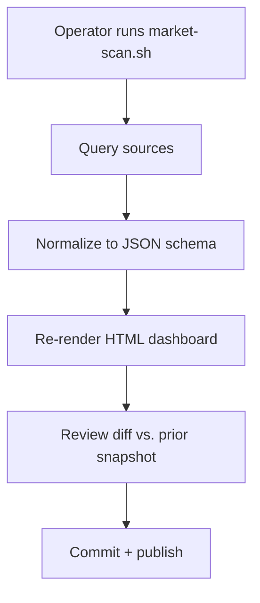

# Tidegate Market Dashboard

## Design Intent

**Context:** A periodic snapshot dashboard that maps the security tooling market against Tidegate's threat model to identify competitive gaps and market response patterns.

### Goals

- Provide a single view of how existing tools map to Tidegate's three enforcement layers (L1 taint, L2 MCP gateway, L3 egress proxy)
- Surface which threat vectors are covered by commercial/open-source tools vs. which remain gaps
- Enable periodic re-scanning to detect market movement (new tools, feature additions, positioning shifts)
- Support composability analysis — which tools can be combined vs. which are mutually exclusive

### Constraints

- Dashboard must be static HTML (no build step, no framework dependencies)
- Data model must support automated updates via script (market scanning → JSON → render)
- Visual encoding must distinguish "structural coverage" (architecture matches Tidegate) from "feature coverage" (marketing claims)
- Must fit on a single screen at 1920×1080 without scrolling

### Non-goals

- Real-time market monitoring — this is a periodic snapshot, not a live feed
- Vendor scoring or ratings — coverage mapping only, no quality judgments
- Tool recommendations — the dashboard surfaces gaps, not solutions
- Integration with external APIs — data is collected manually or via scripted scraping, stored as static JSON

## Interaction Surface

This design covers the **market intelligence dashboard** — a single-page HTML view showing:

- **Threat model matrix** — Tidegate's attack surface scorecard as the primary organizing structure
- **Tool positioning** — each tool plotted against the enforcement layers it addresses
- **Gap analysis** — visual highlighting of threats with no market coverage
- **Composability grid** — which tools can be deployed together vs. conflicts

The dashboard is read-only. Data updates happen via script (`market-scan.sh` or similar) that regenerates the JSON data file and re-renders the HTML.

## User Flow

1. **Operator runs market scan** — script queries predefined sources (GitHub, vendor docs, security blogs)
2. **Script updates `market-data.json`** — normalized tool entries with coverage metadata
3. **Script re-renders dashboard** — static HTML regenerated from template + data
4. **Operator reviews changes** — diff against prior snapshot, note new tools or coverage shifts
5. **Dashboard published** — committed to `docs/market/` or hosted internally

## Screen States

### Primary View (default)

Full dashboard with all sections visible:
- Header with snapshot date and source count
- Threat model matrix (left)
- Tool positioning grid (right)
- Composability analysis (bottom)

### Filtered View (search/filter active)

- Search box filters tools by name or coverage area
- Filter chips for enforcement layer (L1/L2/L3), license type, deployment model
- Filtered tools dimmed or hidden

### Gap-Focused View (toggle)

- "Show gaps only" toggle hides covered threats
- Highlights threats with zero market coverage
- Useful for prioritizing Tidegate development

## Edge Cases and Error States

| Scenario | Behavior |
|----------|----------|
| No tools in a category | Show empty state with "No market coverage" label, highlight as gap |
| Tool data missing required fields | Render with "Incomplete" badge, link to data source for manual review |
| Dashboard fails to load | Static HTML has no JS dependencies — failure mode is stale data, not broken UI |
| JSON schema mismatch | Dashboard shows error banner: "Data schema mismatch — regenerate data" |

## Design Decisions

### Static HTML over framework

**Decision:** Dashboard is a single HTML file with embedded CSS/JS, no build step.

**Rationale:**
- Eliminates dependency drift — dashboard renders identically in 5 years
- Simplifies automation — script writes one file, no npm/node/python pipeline
- Reduces cognitive load — no framework concepts to learn, just HTML/CSS
- Enables git-diff — changes to dashboard are visible in commit diffs

**Trade-off:** More manual work for complex interactions, but dashboard is read-only so this is acceptable.

### Threat model as primary structure

**Decision:** Tidegate's attack surface scorecard organizes the dashboard, not tool categories.

**Rationale:**
- Keeps focus on gaps (what threats are uncovered) rather than features (what tools exist)
- Prevents vendor marketing from framing the analysis
- Makes it easy to spot "me too" tools vs. differentiated coverage

**Trade-off:** Requires mapping each tool to threat vectors (manual or scripted), but this is the core analytical work anyway.

### Composability as explicit dimension

**Decision:** Tools are tagged with compatibility metadata (can coexist / mutually exclusive / redundant).

**Rationale:**
- Operators need to know which tool combinations are viable
- Surfaces market gaps where no composable solution exists
- Prevents false sense of security from overlapping tools

**Trade-off:** Requires judgment calls on compatibility — documented in data source comments.

## Assets

| File | Description |
|------|-------------|
| `docs/design/Active/(DESIGN-001)-Tidegate-Market-Dashboard/dashboard.html` | Primary dashboard HTML (generated) |
| `docs/design/Active/(DESIGN-001)-Tidegate-Market-Dashboard/market-data.json` | Tool coverage data (generated) |
| `docs/design/Active/(DESIGN-001)-Tidegate-Market-Dashboard/market-scan.sh` | Data collection script (TBD) |
| `docs/design/Active/(DESIGN-001)-Tidegate-Market-Dashboard/schema.json` | JSON schema for tool entries |

## Lifecycle

| Phase | Date | Commit | Notes |
|-------|------|--------|-------|
| Proposed | 2026-04-07 | -- | Initial creation |
