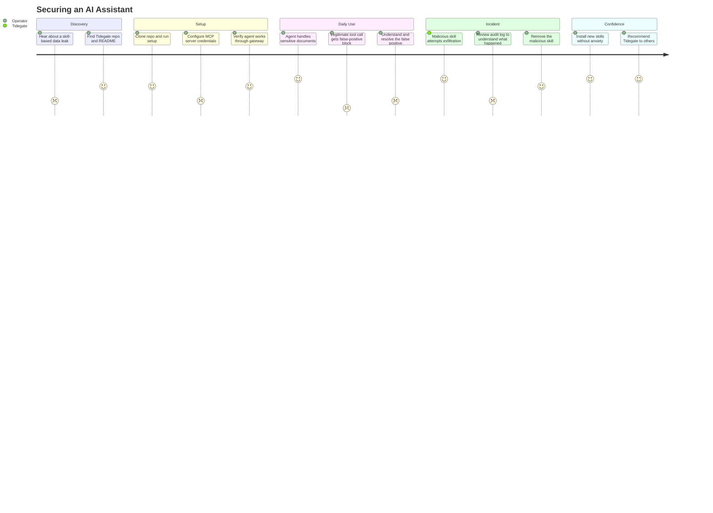

# JOURNEY-001: Securing an AI Assistant

## Persona

[PERSONA-001: Personal Assistant Operator](../../../persona/Validated/(PERSONA-001)-Personal-Assistant-Operator/(PERSONA-001)-Personal-Assistant-Operator.md) — runs an AI agent daily to process bank statements, emails, tax documents, and medical records. Installs community skills without reading source code.

## Goal

Go from "I run an AI agent with access to my sensitive data and hope nothing bad happens" to "I trust my agent because I know it structurally can't leak my data."

## Steps / Stages

### 1. Discovery

The operator hears about Tidegate — maybe from a blog post, a friend, or after reading about a skill-based data leak. They find the repo and read the README.

### 2. Setup

The operator clones the repo and runs setup. They provide their MCP server credentials (Slack token, GitHub token, etc.) and point Tidegate at their agent. The setup process creates the container topology.

> **PP-01:** The operator has to understand Docker networking, MCP configuration, and credential management to get things running. If this takes more than a few minutes, they give up and use the unprotected agent directly.

### 3. Daily Use

The agent handles daily tasks — reading bank statements, drafting emails, managing files — through Tidegate. Tool calls flow through the gateway. The operator doesn't notice the scanning; things just work.

> **PP-02:** A legitimate tool call gets blocked by a false positive (e.g., a long numeric string in a financial summary triggers the credit card scanner). The operator sees a confusing error and doesn't know why their agent stopped working.

### 4. Incident

A community skill the operator installed tries to exfiltrate data. Tidegate blocks the tool call and logs the attempt. The operator reviews the audit log and removes the skill.

> **PP-03:** The operator doesn't know the audit log exists or how to read it. The incident happened silently — the skill was blocked, but the operator has no visibility into what happened or why.

### 5. Confidence

Over time, the operator trusts the setup. They install new skills freely, knowing Tidegate is watching the boundaries. They recommend it to friends who also run AI agents with sensitive data.

## Pain Points

### Pain Points Summary

| ID | Pain Point | Score | Stage | Root Cause | Opportunity |
|----|------------|-------|-------|------------|-------------|
| JOURNEY-001.PP-01 | Setup requires Docker and MCP knowledge | 2 | Setup | Operator must understand container networking, credential mounting, and MCP config to get started | One-command setup that infers config from existing agent installation |
| JOURNEY-001.PP-02 | False positives block legitimate work | 1 | Daily Use | Scanner flags benign numeric strings as credit cards, or benign hex as credentials | Empirical tuning (SPIKE-002), per-tool sensitivity profiles, clear error messages explaining what was blocked and why |
| JOURNEY-001.PP-03 | No visibility into security events | 2 | Incident | Audit log exists but is not surfaced to the operator in an accessible way | Dashboard or notification when a tool call is blocked; human-readable incident summaries |

## Opportunities

1. **Zero-config setup** — Detect the operator's existing agent installation and MCP config, generate Tidegate config automatically. The operator provides credentials; Tidegate handles topology.
2. **Transparent false-positive handling** — When a tool call is blocked, show the operator exactly what was flagged, why, and how to allowlist it if it's benign. Make the scanner's reasoning visible.
3. **Incident awareness** — Surface blocked exfiltration attempts proactively. A daily summary email, a CLI dashboard, or a notification when something interesting happens in the audit log.
4. **Confidence building** — Show the operator what Tidegate is doing: "Today your agent made 47 tool calls. 46 passed. 1 was blocked (credential pattern in a Slack message draft). Here's what it looked like."

## Lifecycle

| Phase | Date | Commit | Notes |
|-------|------|--------|-------|
| Draft | 2026-03-11 | _TBD_ | Initial journey for PERSONA-001 under VISION-002 |
